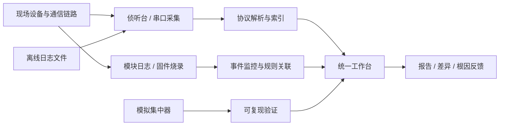
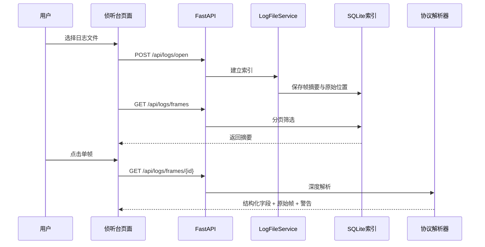

# 侦听台产品设计文档

> 版本：v1.0  
> 更新时间：2026-08-15  
> 文档定位：面向产品、测试、现场支持、项目管理和新成员的产品总览。本文以当前代码和已有设计文档为依据；“现状”表示已经存在的实现，“规划”表示工作台和 AI 闭环方向中的设计目标。

## 1. 一句话说明

侦听台是一套面向电力线载波（HPLC）抄表通信现场的“采集—解析—定位—验证”工具。它把原本分散在串口、原始日志、协议文档、模块运行状态和测试脚本里的信息，组织成可检索、可展开、可对照、可复现的证据链，帮助工程人员回答：

> 现场到底发生了什么？哪一帧、哪一个模块、哪一个协议字段或哪一个交互步骤出了问题？这个结论能否被复现和验证？

它不是生产系统中的集中器，也不是电表抄表业务平台；它是研发、测试、联调和现场问题排查使用的诊断与验证工作台。

## 2. 要解决的痛点

### 2.1 现场问题被切成了多个孤立视角

工程人员通常需要同时打开串口工具、日志查看器、协议解析工具和烧录工具。每个工具只看到一部分事实，问题定位依赖人工记忆和复制粘贴。

### 2.2 原始十六进制报文无法直接回答业务问题

原始帧只能说明“收到了哪些字节”，不能直接说明报文类型、方向、地址、任务、时间、嵌套报文或分钟采集字段。不同协议（国网、南网、645、698、双模 1376.2/10376）还存在多层嵌套和变长结构。

### 2.3 大日志文件难以浏览和反复分析

日志文件可能很大，直接交给浏览器会带来加载、内存和检索问题。用户需要先建立索引，再按帧号、时间、NID 等条件筛选，并在需要时才展开单帧深度解析。

### 2.4 模块状态和通信报文之间缺少关联

模块日志中的 RX/TX、状态变化、超时、重试、成功和失败事件，往往要和侦听到的通信帧放在一起看。只看报文或只看模块日志，都可能误判根因。

### 2.5 问题修复后缺少可重复的验证闭环

仅凭一次现场日志无法证明修复有效。需要模拟集中器、场景步骤、期望事件、实际事件、差异和归因反馈，形成可重复的验证记录。

## 3. 产品目标与非目标

### 3.1 产品目标

- 降低从“发现异常”到“定位根因”的时间。
- 把原始通信证据转换为协议结构和业务语义。
- 支持实时采集与离线日志分析两种工作方式。
- 让报文、模块日志、协议解析和测试结果能够相互跳转或对照。
- 让典型通信流程可以模拟、执行、比较和留档。
- 保持底层解析能力可独立复用，便于后续扩展协议和接入其他工具。

### 3.2 非目标

- 不替代现场集中器、CCO、STA 或电表的生产控制系统。
- 不负责正式的电力营销、计费、档案或抄表数据管理。
- 不把所有底层应用强行合并为一个服务；统一工作台主要负责挂载、编排和统一入口。
- 不以“自动给出绝对正确结论”为目标；解析结果和规则判断必须能回溯到原始证据。

## 4. 用户与典型任务

| 用户 | 主要问题 | 使用路径 |
|---|---|---|
| 协议研发 | 某个报文或字段是否按协议实现 | 导入/采集日志 → 筛选帧 → 深度解析 → 查看原始帧与结构化字段 |
| 联调测试 | CCO、STA、集中器交互是否符合预期 | 实时监听或模拟集中器 → 执行场景 → 对照事件序列 → 查看差异 |
| 现场支持 | 现场故障发生在链路、模块还是协议层 | 选择日志 → 建索引 → 按 NID/时间/任务筛选 → 查看关联事件和分钟统计 |
| 模块开发 | 固件运行状态、烧录过程是否正常 | 模块日志页 → 观察 RX/TX 与状态 → 必要时 XMODEM 烧录 → 复核日志 |
| 项目负责人 | 当前能力、验证结果和遗留问题是什么 | 查看统一工作台中的场景运行记录、报告和需求状态 |

## 5. 产品与实际系统的关系



### 5.1 与实际生产系统的边界

现场真实系统包括集中器、CCO、STA、电表、通信介质和上位机业务软件。侦听台通常以旁路观察者或测试端的身份接入：

- 通过串口接收通信流，保留原始帧，并尝试切出以 `7E` 为边界的 HPLC 帧。
- 通过日志文件重放已经发生过的现场行为。
- 通过协议解析器把帧转换成协议层级、字段和嵌套数据。
- 通过模块日志观察模块侧状态和事件。
- 通过模拟集中器主动构造 1376.2/10376 流程，验证模块应答和任务判断。

侦听台的输出是诊断证据和验证报告，不直接改变生产系统的业务数据。

## 6. 功能地图

### 6.1 侦听台：通信帧采集与分析

入口：`apps/listener/`，默认端口 8765。

核心能力：

1. **实时串口采集**：配置 COM 口和串口参数，接收连续字节流，切分帧并落盘。
2. **离线日志分析**：选择日志文件，建立 SQLite 索引，避免每次浏览都重新扫描大文件。
3. **帧列表与筛选**：按序号、时间、NID、关键字和分页查看摘要。
4. **单帧深度解析**：按需调用解析链，查看 FCH、MPDU、应用层、645/698 等嵌套结构。
5. **分钟采集分析**：按周期聚合分钟采集报文，查看任务、周期、上下行和删除配置统计。
6. **原始证据回看**：结构化字段必须能回到对应原始帧。

### 6.2 模块日志与烧录

入口：`apps/module_log/`，默认端口 8766。

核心能力：

- 同时观察 CCO/STA 等模块串口日志。
- 对 RX/TX 日志加时间戳并分类落盘。
- 对关键日志内容运行 `loghooks` 规则，形成事件、状态序列和来源关联。
- 在模块仍运行时执行 XMODEM 固件烧录，并对传输过程进行状态管理。
- 将原始日志行和解析出的事件绑定，支持双向对照。
- 挂载模拟集中器页面，作为验证入口。

### 6.3 共享协议解析层

主要位置：`libs/shared/`、`libs/parser_lib/`。

它是产品的能力底座，不是面向最终用户的独立页面：

- `parser_service`：输入校验、解析调用和统一错误处理。
- `dotnet_parser`：封装现有 C# `GwHPLCAnalysis.dll`，提供核心 HPLC 解析能力。
- `parser_lib`：提供可扩展的协议适配器和 Python 侧结构化解析能力，包括 645、698、双模和 10376 等方向。
- `shared.infra`：文件选择、目录浏览、运行时路径和通用基础设施。

### 6.4 事件监控与对照解析

主要位置：`libs/loghooks/`、`apps/module_log/loghooks_api.py`。

该模块把“日志文本”转换为“可理解的事件”：

```text
原始日志行
  → 内容匹配 / 规则识别
  → 事件时间线与状态序列
  → 关联来源（串口或文件）
  → 与原始日志行双向对照
```

它关注的是“发生了什么动作和状态变化”，而侦听台解析关注的是“通信帧的协议内容”；两者互补。

### 6.5 模拟集中器

主要位置：`libs/sim_concentrator/`。

模拟集中器用于在没有真实集中器或需要稳定复现时，按 1376.2/10376 帧协议向模块下发请求、接收响应、匹配任务结果并判断步骤是否通过。它是测试驱动器，不是生产集中器的替代品。

### 6.6 验证工作台与统一入口

当前代码入口：`apps/workbench/`；设计目标见 `docs/需求设计方案/platform-一体化工作台详细设计.md`。

统一工作台把多个已有能力组织成标签页和验证流程：

- 侦听台
- 模块日志
- 对照解析
- 模拟集中器
- 验证工作台

工作台的核心对象是一次 `Run`：选择场景、加载固件信息、执行步骤、记录每步结果、生成报告并持久化。场景目前以 JSON 模板表达，例如入网、分钟采集、拉合闸和搜表。

## 7. 功能块之间如何协作

| 上游 | 处理块 | 下游产物 | 典型用途 |
|---|---|---|---|
| 串口字节流 / 日志文件 | 帧切分、索引 | 帧摘要、原始十六进制 | 找到问题发生的时间和对象 |
| 单帧原始数据 | 协议解析器 | 分层字段、嵌套报文、告警 | 判断协议字段和报文语义 |
| 模块 RX/TX 文本 | loghooks 规则 | 事件、状态、序列 | 判断模块内部处于哪个阶段 |
| 事件 + 原始日志 | 对照 API | 事件与日志行绑定 | 让规则结论可回溯 |
| 场景模板 + 模拟串口 | 模拟集中器 runner | 步骤结果、实际事件流 | 复现和验证修复 |
| Run、步骤、解析结果 | Store / Report | SQLite 元数据、JSON 报告 | 留档、比较、回归 |

## 8. 端到端运行逻辑

### 8.1 离线日志分析



### 8.2 实时串口采集

1. 用户选择端口和串口参数。
2. `SerialCaptureService` 启动后台读取线程。
3. 输入字节流按 HPLC 帧边界切分，增加时间和序号。
4. 原始内容写入 `data/logs/侦听台/`，同时交给日志服务建立可查询数据。
5. 页面通过状态接口和帧接口查看运行状态与结果。
6. 停止采集后，日志文件仍可作为离线输入重新索引。

采集和日志索引存在互斥：日志正在建立索引时不能启动串口采集，串口正在运行时不能重新建立索引，避免同一数据源出现竞态和结果不一致。

### 8.3 模块日志事件分析

```text
模块串口 / 日志文件
  → 行级标准化
  → 规则匹配与内容提取
  → 事件时间线 / 状态路径
  → 绑定原始日志行
  → 对照页面展示
```

### 8.4 场景验证闭环

```text
选择场景
  → 创建 Run
  → 执行模拟下发 / 监听 / 匹配
  → 记录 StepResult
  → 期望序列 vs 实际事件流
  → 规则归因与反馈
  → 保存报告
```

## 9. 数据与证据模型

产品中的结果应按以下层级理解：

1. **原始证据**：串口字节、原始日志行、原始日志文件。
2. **索引证据**：帧序号、时间、文件位置、NID、摘要。
3. **解析证据**：协议层级、字段、嵌套报文、解析警告。
4. **事件证据**：模块状态、动作、错误、时间线和来源绑定。
5. **验证结论**：某个场景步骤是否通过、差异在哪里、推断的根因是什么。

越靠后的结论越需要能追溯到前面的证据。任何“失败”“异常”“字段缺失”的提示，都应区分：协议解析失败、数据不完整、规则未匹配、设备未响应，不能统称为同一种错误。

## 10. 典型使用流程

### 流程 A：现场日志定位

1. 打开侦听台，选择现场日志。
2. 等待索引完成，先看日志总量和时间范围。
3. 使用 NID、任务号、时间段或关键字缩小范围。
4. 查看帧详情，展开协议层和嵌套报文。
5. 对照模块日志中的同一时间段，判断是发送、接收、解析还是响应超时。
6. 导出或记录原始帧、解析结果和结论。

### 流程 B：验证协议或固件修复

1. 选择对应场景，例如入网、分钟采集、搜表或拉合闸。
2. 准备固件版本、提交号和串口配置。
3. 使用模拟集中器执行场景，或接入真实设备并启动侦听。
4. 查看每一步的期望事件、实际事件和差异。
5. 对失败步骤下钻到原始日志或报文。
6. 保存 Run 报告，作为回归验证证据。

### 流程 C：模块维护与烧录

1. 启动模块日志，确认 CCO/STA 通道状态。
2. 观察 RX/TX 和关键状态事件。
3. 进入烧录流程，按 XMODEM 阶段完成传输。
4. 复核烧录后的启动日志和协议交互。
5. 必要时用模拟集中器执行一组最小回归场景。

## 11. 当前实现与演进边界

### 已实现或已有代码支撑

- 侦听台独立 Web 应用和串口采集。
- 大日志文件索引、分页、筛选和单帧详情。
- HPLC、FCH/MPDU、645/698/双模等解析链路。
- 分钟采集分析和任务统计接口。
- 模块日志实时采集、分类落盘、XMODEM 烧录。
- loghooks 规则驱动的事件监控与原始日志对照。
- 模拟集中器的帧构造、串口交互、应答匹配和任务执行。
- workbench 的场景、Run、步骤、报告和 SQLite/JSON 持久化基础。

### 仍属于规划或需要继续完善的方向

- 将多个应用以统一工作台形式完整交付，而不是只保留独立入口。
- 通用的期望序列 vs 实际事件流比较和可视化。
- 失败步骤的规则化根因反馈。
- 场景模板化、循环/可选步骤、golden 回放。
- 更完整的并发抄表数据单元与请求—响应关联。
- 协议文档与代码之间的差异确认，尤其是部分分钟采集字段和报文变体。
- 更高覆盖率的现场事件规则和真实大日志回归验证。

## 12. 关键设计原则

- **证据优先**：任何结论都应能回到原始帧或原始日志。
- **按需深解析**：列表先提供轻量摘要，用户点击后再执行完整解析。
- **实时与离线同构**：实时采集产出的日志应能被离线流程再次打开分析。
- **底层能力解耦**：应用负责交互和编排，解析库负责协议能力，规则引擎负责事件识别。
- **现状与规划分离**：统一工作台是产品形态，不意味着底层应用已经合并。
- **可复现**：场景、固件、输入源、步骤结果和报告要一起留档。
- **失败可解释**：区分无数据、数据不完整、解析失败、设备无响应和规则未覆盖。

## 13. 对外解释模板

向非开发者介绍本产品时，可以这样说：

> 侦听台是电力线载波通信的故障诊断和验证工具。它像“网络抓包工具 + 协议解析器 + 模块日志分析器 + 测试工作台”的组合：先把设备通信过程记录下来，再把十六进制报文翻译成协议和业务字段，同时把模块日志中的状态变化串起来；如果需要，还可以用模拟集中器重现一套通信流程，最后给出可追溯的差异和验证报告。

## 14. 参考实现位置

- 产品现状总览：`README.md`
- 侦听台应用：`apps/listener/`
- 模块日志应用：`apps/module_log/`
- 共享解析能力：`libs/shared/`、`libs/parser_lib/`
- 事件规则与引擎：`libs/loghooks/`
- 模拟集中器：`libs/sim_concentrator/`
- 验证工作台：`apps/workbench/`
- 一体化工作台设计：`docs/需求设计方案/platform-一体化工作台详细设计.md`
- 功能与遗留项：`docs/总设计框架/AI闭环平台项目设计需求文档.md`、`docs/需求管理/待完成需求.md`

