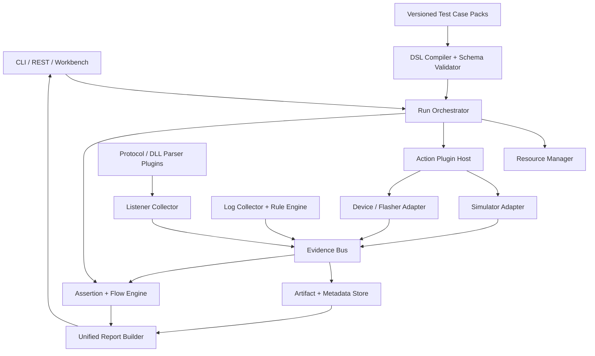

# 项目现状与独立验证框架分析报告

- 生成时间：2026-08-16 13:17:07（Asia/Shanghai）
- 分析范围：`docs/`、项目 README 与目录现状
- 分析目标：明确当前开发所需能力、建议骨架、模块解耦方式和最终交付效果

## 1. 结论先行

本项目已有侦听台、模块日志、日志事件识别、模拟集中器和统一工作台雏形，不宜再按“三个独立工具分别扩功能”的方式继续演进。下一阶段应建设一个独立的自动验证框架：三类模块只负责产生证据或执行刺激，统一内核负责加载用例、调度资源、关联证据、执行断言和生成报告。

框架的核心交付不是一个新页面，而是五套稳定契约：

1. 可版本化、可替换的测试用例包契约；
2. 可替换的采集器、协议解析器、DLL 解析器、动作和断言插件契约；
3. 三模块共用的事件/证据交换协议；
4. 可取消、可清理、可回放的统一 Run 状态机；
5. 人和脚本都能读取的统一报告协议。

最终目标应定义为：工程师选择一个用例包并提供参数，平台自动启动采集、执行模拟交互、匹配模块日志、解析网络帧、做跨源时序关联，最后只输出 `passed / failed / inconclusive / aborted` 之一以及完整证据链。换协议、换 DLL、换日志规则、换流程时，主要动作是更换插件或用例包，不修改框架内核。

## 2. 本次文档盘点

语料检测共发现 48 个可分析文件，约 61,739 词：

| 类型 | 数量 |
|---|---:|
| Markdown/HTML/Word 等文档 | 39 |
| 协议 PDF | 4 |
| 图片 | 3 |
| OpenAPI/SQL 等结构文件 | 2 |

另有 3 个敏感项被分析工具自动跳过。知识图谱成功提取 17 份架构/需求文档和 3 张图片，共覆盖 20/46 个语义文件；另一组 22 份长文档在返回阶段中断，4 份协议 PDF 在重试时主动省略，未进入图谱。框架结论同时通过关键文档的直接段落核对，不依赖协议 PDF 的逐字段内容。`openapi.json` 未被结构提取器生成节点，`schema.sql` 因本地缺少 SQL AST 扩展未进入结构图，后续可通过接口契约和数据库迁移测试单独校验。

## 3. 当前项目处于什么阶段

### 3.1 已有能力

根据当前文档，已有代码或已有代码支撑包括：

| 能力 | 当前位置 | 当前定位 |
|---|---|---|
| 网络帧采集、日志索引、协议解析、分钟统计 | `apps/listener/`、`libs/shared/`、`libs/parser_lib/` | 网络证据源 |
| 模块串口日志、分类落盘、XMODEM 烧录 | `apps/module_log/` | 模块证据源与设备动作 |
| 文本规则、序列规则、事件化、跨来源关联 | `libs/loghooks/` | 日志判定引擎 |
| 1376.2 构帧、发送、接收、应答、任务判定 | `libs/sim_concentrator/` | 流程刺激和交互证据源 |
| 场景、Run、步骤、JSON/SQLite 持久化基础 | `apps/workbench/` | 控制面雏形 |
| C# HPLC 动态库和 Python 协议适配器 | `libs/shared/dll/`、`libs/parser_lib/adapters/` | 可继续封装的解析能力 |

现状说明项目已越过“单模块原型”阶段，但还没有形成稳定的、模块无关的验证产品契约。

### 3.2 明确未完成或需要增强的能力

文档中的主要未完成项包括：

- 统一 Run 抽象与稳定状态机；
- 统一报告 schema 与三源聚合；
- 通用的“期望流程 vs 实际事件流”比较；
- 缺失、超时、乱序、负向触发四类差异；
- 可选步骤、循环、重试、负向断言和时序约束；
- 场景模板化、golden 数据回放；
- 失败根因规则与反馈组装；
- 可加载测试用例包、动作插件、断言插件和设备适配器；
- 一体化程序与可复制到其他 Windows 机器的打包交付；
- 分钟采集协议专项、OAD/OI 覆盖和部分真实硬件验收。

### 3.3 文档口径冲突

当前文档存在需要开发前确认的基线冲突：

- 产品设计文档称 `workbench` 已有场景、Run、步骤、报告和 SQLite/JSON 持久化基础；
- 待完成需求却将 FR-5.1 Run 抽象、FR-5.2 统一报告标记为“无”；
- README 已给出 `python -m workbench.run`，最终设计又计划从 `workbench` 演进为 `platform`。

建议将其解释为“存在原型，但尚未达到通用契约和产品验收标准”。正式排期前应对 `apps/workbench/orchestration/` 做一次代码级基线审计，输出“保留、重构、废弃”清单，防止重复开发。

## 4. 目标边界

### 4.1 框架负责

- 用例包发现、版本选择、schema 校验和内容哈希；
- 插件发现、能力声明、兼容性检查和生命周期管理；
- Run 创建、资源锁、取消、超时、重试、清理和状态持久化；
- 统一事件/证据接入、时间基准、关联索引和证据冻结；
- 动作执行、断言执行、流程比对和结论聚合；
- JSON、HTML、Markdown 报告与机器退出码；
- CLI、REST API 和统一工作台入口。

### 4.2 三模块负责

- 侦听台：采集网络帧，调用选定解析插件，输出标准帧证据和局部报告；
- 日志模块：读取指定日志源，加载指定规则包，输出标准事件证据和局部报告；
- 模拟集中器：加载指定流程，发送刺激、接收响应，输出标准交互证据和局部报告。

### 4.3 框架不负责

- 在内核中硬编码国网、南网、安徽或某一报文 ID；
- 在内核中硬编码某个 DLL 的函数名或返回结构；
- 允许用例包直接执行任意上传的 Python 代码；
- 用 AI 文本代替确定性断言；
- 把三个模块合并成互相 import 的单体业务代码。

## 5. 推荐总体骨架



### 5.1 推荐目录

以下目录是在现有 `apps/`、`libs/` 基础上的目标骨架。名称可调整，但职责边界不应混合。

```text
apps/
└── platform/
    ├── app.py                    # 统一 FastAPI 入口，只挂载和编排
    ├── run.py                    # headless 服务入口
    ├── desktop.py                # pywebview 桌面入口
    ├── api/
    │   ├── runs.py               # Run 创建、取消、查询、报告
    │   ├── cases.py              # 用例包目录与校验结果
    │   ├── plugins.py            # 插件能力与健康状态
    │   └── artifacts.py          # 证据读取与下载
    └── static/                   # 统一页面；不承载业务规则

libs/
├── verification_contracts/
│   ├── case.py                   # CaseManifest / Plan / ParameterSpec
│   ├── run.py                    # Run / Step / RunStatus
│   ├── evidence.py               # EvidenceEnvelope / RawRef / Correlation
│   ├── plugin.py                 # PluginManifest / Capability / Health
│   ├── report.py                 # Report / Finding / Verdict
│   └── schemas/                  # 对外 JSON Schema，独立版本号
├── verification_runtime/
│   ├── catalog.py                # 用例与插件发现、版本选择
│   ├── compiler.py               # YAML/JSON DSL 校验与编译
│   ├── orchestrator.py           # Run 状态机
│   ├── resources.py              # 串口、设备、文件、端口租约
│   ├── event_bus.py              # 统一证据协议与订阅
│   ├── correlator.py             # 时间、任务号、MAC、NID 等关联
│   ├── assertions.py             # 断言调度与结果归并
│   ├── flow_compare.py           # 缺失/超时/乱序/负向判断
│   ├── artifacts.py              # 原始证据冻结、内容哈希
│   └── report_builder.py         # JSON/HTML/Markdown 报告
├── verification_plugins/
│   ├── listener_adapter/         # 封装现有 listener
│   ├── module_log_adapter/       # 封装 module_log + loghooks
│   ├── simcon_adapter/           # 封装 sim_concentrator
│   ├── parser_python/            # parser_lib 插件
│   ├── parser_dotnet/            # DLL 插件与进程隔离
│   └── device_adapters/          # 烧录、继电器、电源等受控动作
├── listener/                     # 保留现有底层能力
├── loghooks/                     # 保留现有底层能力
├── sim_concentrator/             # 保留现有底层能力
├── parser_lib/                   # 保留现有协议适配器
└── shared/                       # 通用基础设施

test_assets/
├── cases/                        # 可独立安装/升级的用例包
├── rule_packs/                   # 日志规则包
├── protocol_packs/               # 协议元数据/字典/解析插件清单
└── fixtures/golden/              # 审定帧、日志、交互记录

data/runs/<run_id>/
├── manifest.json                 # 运行参数、版本、插件、环境
├── evidence.jsonl                # 标准证据流
├── artifacts/                    # 原始帧、日志、解析输出
├── report.json                   # 机器报告
├── report.html                   # 人工阅读报告
└── report.md                     # 可归档文本报告
```

## 6. 最关键的解耦契约

### 6.1 测试用例包

用例包是最小可交付验证单元，建议保留现有文档提出的结构：

```text
test_assets/cases/<case-id>/
├── case.yaml                     # id、版本、范围、兼容性、入口计划
├── plan.yaml                     # setup/stimulus/wait/assert/cleanup
├── parameters.schema.json        # 运行参数
├── listener/
│   ├── filters.yaml
│   └── assertions.yaml
├── loghooks/
│   └── rules.yaml
├── simcon/
│   ├── interactions.yaml
│   └── frame_templates.yaml
├── fixtures/golden/
└── README.md
```

用例包只能引用框架登记过的动作、断言和适配器。需要新执行能力时，新增受版本控制的插件，不允许从用例包加载任意脚本。

### 6.2 插件清单

每个插件至少声明：

```json
{
  "plugin_id": "parser.gwhplc.dotnet",
  "plugin_version": "1.0.0",
  "contract_version": "1.0",
  "kind": "parser",
  "capabilities": ["hplc.frame.parse", "hplc.version.read"],
  "platform": ["windows-x64"],
  "entrypoint": "process://parser-dotnet-host",
  "config_schema": "schemas/config.json",
  "healthcheck": "parser.health"
}
```

框架只认识 `kind + capability + contract_version`，不认识具体 DLL 文件名。DLL 路径、导出方法、编码、返回值转换都封装在 `parser_dotnet` 插件内。

### 6.3 自定义交互协议

对于同进程、稳定且无崩溃隔离需求的 Python 插件，可使用类型化函数接口。对于 DLL、独立进程、未来可能换语言的模块，应使用统一消息信封，经 JSONL/stdin-stdout、WebSocket 或本地 HTTP 传输；传输可替换，消息语义保持一致。

```json
{
  "protocol": "verification-message",
  "version": "1.0",
  "message_id": "msg-...",
  "correlation_id": "run-.../step-...",
  "kind": "command|event|result|error|heartbeat",
  "type": "listener.start|parser.parse|log.event|simcon.tx|assert.result",
  "sent_at": "2026-08-16T13:17:07.123+08:00",
  "payload": {},
  "error": null
}
```

协议必须具备：版本协商、请求关联、幂等键、超时、错误码、心跳、最大消息大小、二进制外置引用和向后兼容策略。原始大日志与帧文件不应塞入消息体，只传内容哈希和 `raw_ref`。

### 6.4 统一证据信封

```json
{
  "evidence_id": "ev-...",
  "run_id": "run-...",
  "step_id": "sta-minute-report",
  "source": "listener|module_log|simcon|device",
  "kind": "frame|log_line|event|interaction|operation",
  "captured_at": "2026-08-16T13:17:07.123+08:00",
  "monotonic_ns": 0,
  "raw_ref": "artifacts/listener/000023.bin",
  "raw_sha256": "...",
  "parser": {"plugin_id": "...", "version": "..."},
  "parsed": {},
  "correlation": {"task_no": "1", "sta_mac": "...", "nid": "..."},
  "quality": {"complete": true, "clock_precision_ms": 10, "warnings": []}
}
```

三模块都输出此信封，报告层不再直接依赖模块内部对象。

## 7. 三个模块的标准化接口

### 7.1 侦听台插件

输入：

- 数据源：串口、日志文件、golden 回放；
- 采集窗口：run/step 起止 checkpoint；
- 过滤条件：方向、NID、MAC、报文 ID、字段表达式；
- 解析能力：指定 `parser capability`，不直接指定业务类；
- 断言规则：数量、字段、时序、覆盖率、无异常帧。

输出：

- 原始帧证据；
- 帧摘要和解析字段；
- 统计项；
- 解析警告与数据完整性；
- 侦听台局部报告。

解析 DLL 必须运行在适配器或独立 host 中。替换 DLL 时只更改插件清单与配置；用例按 capability 选择解析器。

### 7.2 日志规则插件

输入：

- 一个或多个日志源；
- 规则包版本；
- 文本、正则、JSON、跨行序列、负向事件和时间窗口规则；
- 源码位置等可选审计元数据。

输出：

- 原始日志行引用；
- 标准事件；
- 序列状态；
- 缺失、超时、乱序、负向触发；
- 日志局部报告。

规则文件与固件版本要显式绑定。日志格式变化时升级规则包，不修改引擎。

### 7.3 模拟集中器流程插件

输入：

- 流程计划和参数；
- 构帧模板；
- 应答规则；
- `send / expect / expect_no_reply / loop / optional / cleanup` 步骤；
- 指定协议 codec capability。

输出：

- 每一步 TX/RX 证据；
- 匹配和解析结果；
- 超时、重试与清理记录；
- 模拟集中器局部报告。

流程 DSL 不直接调用 1376.2 实现。构帧、解帧和匹配分别通过 codec、parser、matcher capability 解析。

## 8. Run 状态机

建议统一状态：

```text
created
  → validating
  → acquiring_resources
  → collecting
  → executing
  → freezing_evidence
  → asserting
  → reporting
  → passed | failed | inconclusive | aborted
  → cleaning
  → completed
```

强制顺序：先申请资源和启动采集，再执行刺激；先冻结原始证据，再执行断言；无论成功、失败、取消或崩溃都必须进入清理阶段。

`inconclusive` 必须是正式结论，不得把“没有采到数据、解析器不可用、时钟不可信、规则未覆盖”误报为业务失败。

## 9. 统一报告

### 9.1 报告最小结构

```json
{
  "schema_version": "1.0",
  "run_id": "run-...",
  "case": {"id": "...", "version": "...", "content_sha256": "..."},
  "environment": {"host": "...", "firmware": {}, "git_commit": "..."},
  "plugins": [],
  "started_at": "...",
  "finished_at": "...",
  "verdict": "passed|failed|inconclusive|aborted",
  "summary": {},
  "steps": [],
  "assertions": [],
  "findings": [],
  "source_reports": {
    "listener": {},
    "module_log": {},
    "sim_concentrator": {}
  },
  "artifacts": [],
  "limitations": []
}
```

### 9.2 人最终看到什么

首页只保留：

- 总结论和置信边界；
- 通过/失败/证据不足数量；
- 失败发生在哪个流程步骤；
- 网络帧、模块事件、模拟交互三条时间线；
- 期望值与实际值差异；
- 最可能根因和建议复核点；
- 一键跳转到原始帧、原始日志行和交互记录。

报告必须允许“只看大局”，但所有结论都能下钻到原始证据。

## 10. 当前开发需要什么

### P0：先冻结契约和打通最小闭环

1. 代码基线审计：确认 `workbench` 的 Run/Report 原型哪些可复用；
2. 建立 `verification_contracts`，发布 Case、Run、Evidence、Plugin、Report 的 v1 JSON Schema；
3. 建立插件加载器和 capability 选择规则；
4. 建立 Run 状态机、资源租约、取消与清理机制；
5. 把 listener、module_log/loghooks、sim_concentrator 各封装成一个适配器；
6. 建立统一证据 JSONL 和 artifact 目录；
7. 建立报告聚合器，先支持 JSON 和 HTML；
8. 选择一个分钟采集用例包跑通端到端闭环。

P0 出口标准：同一个 `run_id` 下能看到模拟集中器 TX/RX、侦听帧、模块日志事件、跨源断言和统一报告；替换测试用例包不需要修改运行内核。

### P1：增强通用流程能力

- 可选步骤、循环、重试、负向断言和时序约束；
- golden 帧/日志/交互回放；
- 通用流程比对与四类差异；
- 插件兼容性矩阵、健康检查和降级策略；
- 失败归因规则与 AI 可消费的结构化反馈；
- 多版本规则包、协议包和用例包回归比较。

### P2：协议专项与交付加固

- 分钟采集待确认字段、0x00E2/E3/E4 和并发抄表关联；
- OAD/OI/DI 词典覆盖；
- Windows + DLL + 真串口硬件在环验收；
- 敏感字段脱敏、签名和产物完整性；
- 单窗口 exe、一键打包发布和离线插件安装。

## 11. 测试与验收骨架

| 层级 | 必须覆盖的测试 |
|---|---|
| 合同测试 | 所有用例包、插件清单、证据、报告必须通过 JSON Schema；旧版本兼容样本必须保留 |
| 插件合同测试 | 同一 capability 的不同实现对同一 golden 输入返回等价结构 |
| 单元测试 | DSL 编译、状态机、资源锁、关联器、断言、流程比对、报告聚合 |
| 回放测试 | 不接硬件即可回放 listener/log/simcon 三源 golden 数据 |
| 故障注入 | DLL 崩溃、串口断开、日志截断、超时、乱序、重复事件、清理失败 |
| 硬件在环 | 入网、分钟采集、拉合闸、搜表、无响应等代表流程 |
| 打包验收 | 新 Windows 10/11 主机无 Python 环境可运行，插件和用例可外置更新 |

建议首期选 10～15 个试点用例，但第一个里程碑只要求一个高价值端到端用例完整跑通；优先证明架构，不先追求用例数量。

## 12. 主要风险

| 风险 | 后果 | 控制措施 |
|---|---|---|
| 文档与代码现状不一致 | 重复开发或误删原型能力 | 先做 workbench 代码基线审计和合同测试 |
| DLL 强耦合或崩溃 | 主进程被拖死、协议无法替换 | 独立 parser host、超时、熔断、健康检查 |
| 三源时间不一致 | 错误关联和错误结论 | Run 单调时钟、checkpoint、精度声明、业务键辅助关联 |
| 用例能执行任意脚本 | 安全与可重复性失控 | 声明式 DSL + 白名单动作插件 |
| 报告只有摘要无证据 | 无法人工复核 | 每条 Finding 强制关联 evidence_id/raw_ref |
| 没有数据被判为失败 | 误导研发 | 正式支持 inconclusive 与 evidence quality |
| 串口/设备争用 | 运行互相干扰 | 资源租约、独占锁、超时和 finally 清理 |
| 协议插件输出各异 | 用例继续与协议耦合 | 标准 ParsedFrame/Field/Warning 合同和合同测试 |

## 13. 建议的实施顺序

1. 用 1～2 天做代码基线审计，确认已有 Run、Report、API 和前端能力；
2. 冻结五套 v1 契约，并为现有三模块编写合同测试；
3. 先实现 headless Runtime，不先重做大前端；
4. 用假串口和 golden 数据打通一个端到端用例；
5. 再接入真实 DLL、真串口和硬件；
6. 把报告接入现有 workbench 页面；
7. 通过第二个协议插件或第二个日志规则包证明“可替换”成立；
8. 最后进行 exe 打包、脱敏、性能和硬件在环加固。

## 14. 最终效果

完成后，使用者的操作应收敛为：

```text
选择用例包与版本
  → 填写设备/串口/固件/协议插件参数
  → 点击运行
  → 平台自动预检并锁定资源
  → 同时启动侦听、模块日志和模拟集中器证据窗口
  → 按流程发送、等待、匹配和断言
  → 自动冻结证据并生成统一报告
  → 人只查看总览；需要时下钻原始证据
```

对新项目或新协议的迁移应变成：安装新的协议插件、DLL 插件、规则包和用例包，运行已有合同测试，然后直接执行。框架内核、统一工作台、证据模型和报告模型保持不变。

因此，项目的合理最终形态不是“侦听台附带日志和模拟功能”，而是“以侦听、日志和模拟交互为证据源的通用验证框架”。侦听台、日志模块和模拟集中器仍能独立运行，但在统一 Run 中通过稳定协议协作，最终让人从逐帧、逐行、逐步骤人工核对，转变为只审阅一份可追溯报告。

## 15. 本轮建议立即确认的三个决策

1. 将 `apps/workbench` 原地演进，还是迁移为 `apps/platform`；建议原地兼容演进，稳定后再重命名，避免大规模路径改动。
2. 插件第一版是否支持进程隔离；建议至少 DLL 解析器强制进程隔离，纯 Python 插件可先同进程。
3. 首个端到端试点用例；建议选择“安徽分钟采集”，因为它同时覆盖刺激、网络帧、模块日志、时序、协议解析和汇总报告，最能验证框架骨架。
