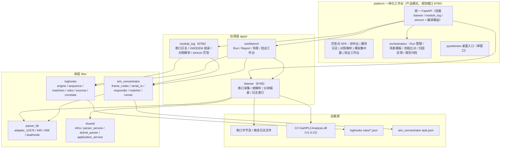
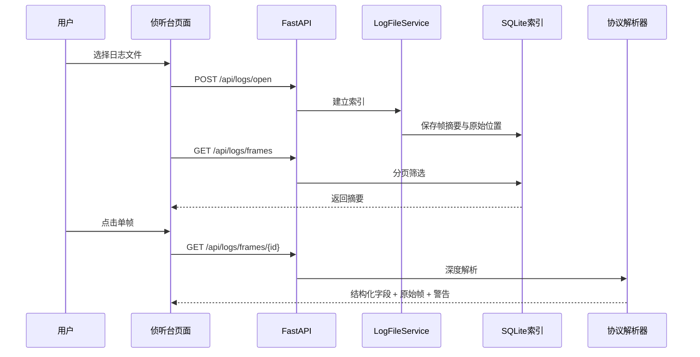

# 侦听台改造项目 —— 最终设计文档（整理版）

> **文档定位**：项目设计侧唯一入口，汇总总体架构、模块设计、数据模型、接口、关键流程、目录结构、设计原则与里程碑。细节仍可回溯到原始设计文档。
> **版本**：v2.0（整理版）｜ **整理日期**：2026-08-15
> **适用范围**：`apps/listener`、`apps/module_log`、`apps/workbench`、`libs/shared`、`libs/parser_lib`、`libs/loghooks`、`libs/sim_concentrator`、`apps/platform`（规划）。
> **配套文档**：`需求文档.md`（需求侧唯一入口）。

---

## 1. 设计目标与产品形态

### 1.1 一句话说明

侦听台是一套面向电力线载波（HPLC）抄表通信现场的 **“采集—解析—定位—验证”** 诊断与验证工作台。它把串口、原始日志、协议文档、模块运行状态和测试脚本中的信息，组织成可检索、可展开、可对照、可复现的证据链。

### 1.2 最终产品形态

交付**一个集成程序**（`platform` 一体化工作台）：

```text
一个桌面入口（pywebview 单窗口）
  → 一个统一后端（FastAPI 主应用，挂载各子应用）
  → 一个页签式 SPA（侦听台 / 模块日志 / 对照解析 / 模拟集中器 / 验证工作台）
  → 一条 AI 闭环（编码 → 烧录 → 运行监控 → 激励验证 → 结论报告 → 归因反馈）
```

**硬性约束**：platform 只做**挂载 + 编排 + 统一外壳**，不合并底层代码、不重实现业务能力；底层各模块保持独立包、独立运行、独立测试。

---

## 2. 总体架构



### 2.1 组件职责

| 组件 | 职责 | 与闭环的关系 |
|------|------|-------------|
| 集中器 | 13762 协议主站侧 | 真实集中器（外场）/ 模拟集中器（实验室） |
| CCO | 协议转换与网络主控 | **被测对象**之一 |
| STA | 网络从节点 | **被测对象**之一 |
| 侦听台 listener | 网络层帧抓取 + 深度解析 | **观测面**：网络层交互的客观证据 |
| 模块日志/烧录 module_log | 串口日志采集 + 固件烧录 | **执行面**：烧录代码、采集模块打印 |
| loghooks | 日志 → 事件化 | **观测面**：运行逻辑的事件化视图 |
| sim_concentrator | 13762 帧激励 + 应答 | **激励面**：向 CCO 注入业务流程并断言 |
| workbench / platform | 统一入口 + 编排 + 报告 | **控制面**：把各能力串成可追溯流水线 |

### 2.2 架构原则

1. **模块解耦**：应用层互不 import，仅共享 `libs/`。
2. **观测与激励分离**：侦听台只读监听，模拟集中器独立可读写串口。
3. **配置驱动**：规则、应答、任务、场景全部外部化 JSON。
4. **解析口径单一**：13762 帧统一走 `adapter_10376`。
5. **决策可追溯**：架构决策继续以 ADR 追加记录（`DECISIONS.md`）。
6. **集成不合并**：platform 只做挂载与编排，底层模块保持独立可测。
7. **证据优先**：任何结论都能回到原始帧或原始日志。
8. **按需深解析**：列表先给轻量摘要，用户点击后才执行完整解析。
9. **实时与离线同构**：实时采集产出的日志应能被离线流程再次打开分析。

---

## 3. 模块设计

### 3.1 侦听台（apps/listener，端口 8765）

**职责**：网络层帧抓取 + 深度解析 + 分钟报表 + 日志索引。

```text
串口字节流 / 日志文件
  → 帧切分（7E 边界）与索引
  → SQLite 帧摘要 + 原始十六进制
  → 按需调用解析链
  → C# DLL 解析 + Python 富化
  → FCH / MPDU / 应用层 / 645-698 嵌套结构
  → 分钟采集持久化与周期统计
```

关键设计点：

- **大文件索引**：二进制逐行读取，只扫描一次；写 SQLite；单页最多 500 条；支持进度、分页、筛选。
- **数据源互斥**：串口监听与日志文件分析运行时互斥（409），索引任务与串口采集互斥。
- **分钟采集**：只认 `APP_PORT=0x11` + 报文 ID `00E2/00E3/00E4`；建索引时把 E4 写入 `minute_reports` 表；周期按 15 分钟默认、时钟边界对齐；去重按“周期 + 站点”计唯一 STA。
- **应用层展开**：前端详情页对 `0003/00E2/00E3/00E4` 渲染 `fields/items/nested` 树。
- **frozen 路径**：打包后 DLL/static 读 `sys._MEIPASS`，runtime（SQLite、last_path）写 exe 同目录。

### 3.2 模块日志 / 烧录（apps/module_log，端口 8766）

**职责**：CCO/STA 串口实时日志 + 同一串口 XMODEM 烧录。

```text
串口持有（ModuleSerialService 常驻独占）
  → 原始字节流实时落盘 data/logs/模块/{cco|sta}/
  → 前端 800ms 增量轮询实时查看
  → loghooks 异步事件化（失败降级）
  → XMODEM 烧录（同一 handle，RX 监控不停）
```

关键设计点：

- **三个页签**：实时日志 / 对照解析 / 模拟集中器。
- **烧录**：复用同一 XMODEM 核心；波特率方案 `9600,115200,9600`（进入 bootloader/传输/恢复）；烧录期间 RX 监控不停；成功须有 `Image download OK` 确认。
- **日志缓冲**：后端内存 5000 行 + 前端 DOM 3000 行环形裁剪。
- **文件选择器**：Windows 原生对话框；上次路径持久化；中文路径 Base64 编码修复。

### 3.3 共享协议解析层（libs/shared + libs/parser_lib）

```text
parser_service      输入校验 → 解析调用 → 统一错误处理
dotnet_parser       封装 C# GwHPLCAnalysis.dll（Python.NET）
application_service Python 富化：抄表帧与分钟采集帧 → DualMode43Adapter
parser_lib.adapters adapter_10376 / adapter_645 / adapter_698 / adapter_dualmode
shared.infra        文件选择、目录浏览、运行时路径、sys.path 注入
```

关键设计点：

- **DLL 是 HPLC 解析的权威**：负责 sniffer 信封、FCH、MAC、TEI 与精确 APS 边界；Python 只消费有界 `APP_RAW` 做应用层富化。
- **富化不破坏原摘要**：`FrmType` 提升为业务类型（如“分钟采集数据上报”），`BaseFrmType` 保留 DLL 原值；适配器失败时保留 `application_error`，索引不丢行。
- **10376 口径单一**：所有 13762 帧解析统一走 `adapter_10376`，不混用其他实现。

### 3.4 事件监控 loghooks（libs/loghooks）

**职责**：把日志文本转换为可理解的事件（日志 → 事件）。

```text
原始日志行 / 侦听帧 / 13762 帧
  → sources 来源注册表（module_log / listener / concentrator_10376）
  → matchers 匹配（text 正则 / field 字段断言）
  → sequence 跨行状态机（bucket 隔离，多节点不串台）
  → 事件时间线 / 状态序列
  → 跨来源关联（业务锚点：NID / MAC / 冻结时刻 / RTUA）
  → 摘要 JSON / 表格 + 规则漂移清单 + 省份识别
```

关键设计点：

- **匹配主锚是消息内容，不是行号**；行号仅作软约束，漂移时事件照常命中并标记 `line_drift`。
- **规则组织**：`rules/common.json` + `rules/provinces/*.json` 全部加载；`scope/province` 字段自带归属；自动识别省份；ID 全局唯一。
- **来源注册表化**：新增来源 = 注册一个解析器函数，规则结构不变。
- **运行时接入**：`_append_line` 写盘后异步调用；`LOG_HOOKS_ENABLED` 可开关；失败静默降级。
- **规则维护闭环**：源码扫描 → `rules diff` → 更新规则 → 真实日志回归。

### 3.5 模拟集中器 sim_concentrator（libs/sim_concentrator）

**职责**：13762 帧激励与应答、验证任务执行。

```text
验证任务 JSON
  → runner 顺序执行步骤
  → frame_codec 构帧 / 切帧 / 解析
  → serial_io 可读写串口（读线程切帧 + 写锁发送）
  → responder 主动应答（内置规则 + 任务/步骤级覆盖）
  → matcher 按 AFN/信封字段/嵌套字段断言
  → 逐步判定 → 结论 JSON（verdict）
```

关键设计点：

- **任务 = 步骤序列**：每步 `send` + `expect` / `expect_no_reply` + 超时；`fail_fast` 控制提前中止。
- **结论可机读**：`steps[].parsed` 含 `fields/items/nested`；CLI 退出码 0=pass、1=fail。
- **不侵入 listener**：独立串口通道，与只读监听互不干扰。
- **挂载模式**：`create_simcon_app(prefix="")` 可挂载到 module_log 或 platform。

### 3.6 统一工作台与编排层（apps/workbench → apps/platform）

**当前**：`apps/workbench` 已有 Run / Report / SQLite / JSON 基础。
**目标**：升级为 `apps/platform/`，包含：

```text
apps/platform/
├── app.py                  # 统一 FastAPI 工厂 create_platform_app()
├── desktop.py              # pywebview 单窗口
├── run.py                  # python -m platform.run → uvicorn 8790
├── orchestration/
│   ├── models.py           # Run / StepResult / Report
│   ├── store.py            # RunStore（SQLite 元数据 + JSON 归档）
│   ├── scenarios.py        # 场景模板库
│   ├── runner.py           # RunExecutor（烧录→监控→激励→报告）
│   ├── compare.py          # 期望流程比对器
│   └── feedback.py         # 归因规则引擎
├── api.py                  # /api/run /api/scenarios /api/compare /api/feedback
├── static/                 # 页签式 SPA
└── scenarios/              # 场景模板 JSON（入网 / 分钟采集 / 拉合闸 / 搜表）
```

挂载策略：

| 挂载路径 | 子应用 | 说明 |
|----------|--------|------|
| `/api/listener` | listener app | 需核对路由前缀后挂载 |
| `/api/module-serial` | module_log app | 同上 |
| `/api/simcon` | `create_simcon_app(prefix="")` | 复用已验证模式 |
| `/api/run` 等 | platform.api 路由 | 编排层 |

**Run 运行时序（目标）**：预检查 → 申请设备/端口资源 → 记录配置与时间基准 → 启动证据订阅（先采集）→ 记录采集起点 → 执行 setup 与刺激步骤 → 等待应答/事件/统计窗口 → 记录采集终点 → 冻结证据 → 对证据运行断言 → 生成 passed/failed/inconclusive/aborted → 清理设备并释放资源。

### 3.7 自动化验证内核（GW-CASS 迁移目标）

**迁移原则**：迁移 GW-CASS 的**测试资产和测试语义**，不迁移其整体实现（不搬 8989 行大线程、全局变量、字符串断言）。

目标拆分：

```text
apps/workbench/          编排与展示（用例、计划、Run、导出）
libs/test_automation/    可复用自动化内核
  ├── models.py          Case / Plan / Step / Assertion / Evidence
  ├── catalog.py         用例目录、标签、版本、来源
  ├── compiler.py        DSL 校验与编译
  ├── executor.py        Run 状态机、取消、重试、失败策略
  ├── resources.py       串口/继电器/设备资源租约与互斥
  ├── adapters/          serial / relay / flasher / simcon / listener / loghooks
  ├── actions/           protocol / device / control
  └── assertions/        frame / event / timing / state
test_assets/             用例元信息、可执行计划、参数集、fixtures、迁移清单
```

**首期范围**：10～15 个试点用例（5 个查询、3 个配置—回读、4 个现有流程、2 个失败/无响应用例），先证明“一个统一 Run 能同时看到下发帧、回包字段断言、模块日志事件和最终报告”。

---

## 4. 数据模型

### 4.1 证据模型（分层）

| 层级 | 内容 | 例子 |
|------|------|------|
| L1 原始证据 | 串口字节、原始日志行、原始日志文件 | `7E FF 02 ... 7E` |
| L2 索引证据 | 帧序号、时间、文件位置、NID、摘要 | SQLite `frames` |
| L3 解析证据 | 协议层级、字段、嵌套报文、解析警告 | `simple.application` |
| L4 事件证据 | 模块状态、动作、错误、时间线、来源绑定 | loghooks 事件流 |
| L5 验证结论 | 场景步骤是否通过、差异、推断根因 | Report / Verdict |

越靠后的结论越要能追溯到前面的证据；任何“失败/异常/字段缺失”提示都应区分：协议解析失败、数据不完整、规则未匹配、设备未响应。

### 4.2 loghooks 规则（核心 schema）

```json
{
  "id": "common.join_onnet",
  "category": "join",
  "level": "info",
  "scope": "common",
  "province": null,
  "source": ["module_log"],
  "match": {
    "mode": "text",
    "pattern": "onnet cnt = (\\d+)",
    "flags": ["i"],
    "file": "aps_ioctrl_nwk.c",
    "line": 950,
    "line_tolerance": 10
  },
  "capture": {"node_count": 1},
  "event": {"type": "network.onnet", "label": "入网节点数", "message": "入网节点数 = {node_count}"}
}
```

sequence 规则：

```json
{
  "id": "common.join_sta_flow",
  "category": "join",
  "scope": "common",
  "source": ["module_log"],
  "event": {"type": "join.sta", "label": "STA 入网流程"},
  "sequence": [
    {"step": "disc_done",   "pattern": "nwk disc done"},
    {"step": "assoc_start", "pattern": "start nwk assoc"},
    {"step": "track_succ",  "pattern": "nwk track done ind.*succ"},
    {"step": "bcn_recv",    "pattern": "recv bcn, from.*NID=([0-9a-fA-F]+)"}
  ],
  "capture": {"nid": 4},
  "window_ms": 30000,
  "on_complete": {"type": "join.sta.ok", "message": "STA 入网成功 NID={nid}"},
  "on_timeout": {"type": "join.sta.timeout", "level": "warn"}
}
```

### 4.3 sim_concentrator 验证任务与结论

```json
{
  "id": "verify.add_node",
  "port": "COM3",
  "baudrate": 115200,
  "enable_responder": true,
  "fail_fast": true,
  "responders": [
    {"match": {"afn": 0x11}, "reply": {"afn": 0x00, "userdata_builder": "confirm"}}
  ],
  "steps": [
    {
      "name": "模拟集中器下发 11H-F1 添加从节点",
      "send": {"afn": 0x11, "seq": 1, "rtsa": "070919051620", "msaa": 1, "pw": 0,
               "userdata": "00 01 68 12 34 56 78 90 12 68 91 08 00 00 00 01 00 12 34 56 78 34 16"},
      "expect": {"afn": 0x00},
      "expect_timeout": 5.0
    }
  ]
}
```

结论：

```json
{
  "task_id": "verify.add_node",
  "steps": [
    {"index": 0, "name": "...", "sent_hex": "68 11 ...", "matched": "68 0F ...",
     "parsed": {"structure": "1376.2", "fields": {}, "nested": []},
     "result": "pass", "reason": "匹配成功"}
  ],
  "summary": {"total": 1, "pass": 1, "fail": 0, "verdict": "pass"}
}
```

### 4.4 Run / Report（FR-5 目标）

```json
{
  "run_id": "run-20260814-0001",
  "firmware": {"version": "v2.3.1", "commit": "a1b2c3d", "flash_file_sha256": "..."},
  "scenario": "minute_collect_anhui",
  "sources": {
    "module_log": {"files": ["data/logs/模块/cco/xxx.log"], "events": 42, "summary": {}},
    "listener": {"frames": 128, "minute_reports": {}},
    "sim_concentrator": {"task_id": "...", "summary": {"total": 5, "pass": 5, "verdict": "pass"}}
  },
  "assertions": [
    {"id": "join.sta.ok", "expected": "STA 入网成功", "actual": "NID=0x61475d", "result": "pass"}
  ],
  "flow_compare": {
    "steps": [{"step": "onnet", "status": "hit", "actual_time": "..."}],
    "missing": [], "timeouts": [], "out_of_order": [], "negated": [],
    "verdict": "pass"
  },
  "verdict": "pass",
  "artifacts": ["data/logs/...", "data/reports/run-....jsonl"],
  "ts": "2026-08-14T10:00:00+08:00"
}
```

RunStore 表：

```sql
CREATE TABLE runs (
  run_id TEXT PRIMARY KEY,
  scenario_id TEXT NOT NULL,
  status TEXT NOT NULL,
  firmware_ver TEXT,
  firmware_commit TEXT,
  created_at TEXT NOT NULL,
  updated_at TEXT NOT NULL,
  report_path TEXT
);
CREATE TABLE run_steps (
  id INTEGER PRIMARY KEY AUTOINCREMENT,
  run_id TEXT NOT NULL REFERENCES runs(run_id),
  seq INTEGER NOT NULL,
  kind TEXT NOT NULL,          -- flash | monitor | stimulus | compare | feedback
  detail TEXT,
  result TEXT                  -- pass / fail / skipped
);
```

### 4.5 场景模板（scenarios）

```json
{
  "id": "minute_collect",
  "name": "分钟采集闭环（安徽）",
  "module": "cco",
  "expected_flow": [
    {"step": "onnet",   "event_type": "network.onnet",    "within_ms": 30000},
    {"step": "collect", "event_type": "collect.minute.e4","within_ms": 60000},
    {"step": "no_error","negate": true, "event_type": "join.assoc.err"}
  ],
  "stimulus": {"task_file": "tasks/minute_collect.json", "responders": []},
  "monitor": {"rules": ["common", "provinces/anhui"], "sources": ["module_log", "listener"]}
}
```

---

## 5. 接口设计

### 5.1 现状接口

| 应用 | 接口 | 说明 |
|------|------|------|
| listener (8765) | `/api/version` | DLL 名称和版本 |
| listener | `/api/parse` | 解析单帧 |
| listener | `/api/logs/open` | 开始建立日志索引 |
| listener | `/api/logs/status` | 索引进度 |
| listener | `/api/logs/frames` | 分页读取帧摘要 |
| listener | `/api/logs/frames/{id}` | 选中帧完整解析 |
| listener | `/api/logs/minute-analysis` | 分钟采集周期统计 |
| listener | `/api/fs/*` | 文件/目录选择 |
| module_log (8766) | `/api/module-serial/*` | 串口状态/日志/烧录 |
| module_log | `/api/loghooks/scan` | 扫描日志文件/目录 → 事件+行绑定 |
| module_log | `/api/loghooks/realtime` | 扫内存日志缓冲（实时模式） |
| module_log | `/api/loghooks/sources` | 来源/模块信息 |
| module_log | `/api/simcon/*` | 模拟集中器子应用（挂载） |
| sim_concentrator (8781) | `GET /api/simcon/status|ports|responders`、`POST /api/simcon/open|close|verify` | 独立运行入口 |
| loghooks CLI | `python -m loghooks scan <log> [--module cco|sta] [--province X] [--correlate <log2>]` | 离线扫描 |
| loghooks CLI | `python -m loghooks rules diff --old <a> --new <b>` | 规则差异 |
| sim_concentrator CLI | `python -m sim_concentrator verify <task.json> [--json]` | 验证任务（退出码 0/1） |

### 5.2 目标新增接口（FR-5 / FR-6）

| 接口 | 说明 |
|------|------|
| `POST /api/run` | 创建验证批次（Run），入参：场景 id、固件信息、参数 |
| `GET /api/run/{run_id}` | 查询批次状态与报告 |
| `GET /api/scenarios` | 场景模板库列表 |
| `POST /api/compare` | 期望流程 vs 实际事件流 → 流程比对结果 |
| `POST /api/feedback` | 由失败结论生成归因反馈文本 |
| `GET /api/platform/status` | platform 统一入口健康检查（各挂载子应用状态） |
| `GET /api/platform/pages` | 页签注册表（前端按此渲染页签） |

---

## 6. 关键流程

### 6.1 离线日志分析



### 6.2 实时串口采集

1. 用户选择端口和串口参数。
2. `SerialCaptureService` 启动后台读取线程。
3. 输入字节流按 HPLC 帧边界切分，增加时间和序号。
4. 原始内容写入 `data/logs/`，同时交给日志服务建立可查询数据。
5. 页面通过状态接口和帧接口查看运行状态与结果。
6. 停止采集后，日志文件仍可作为离线输入重新索引。

### 6.3 模块日志事件分析

```text
模块串口 / 日志文件
  → 行级标准化
  → 规则匹配与内容提取
  → 事件时间线 / 状态路径
  → 绑定原始日志行
  → 对照页面展示
```

### 6.4 场景验证闭环

```text
选择场景
  → 创建 Run
  → 执行模拟下发 / 监听 / 匹配
  → 记录 StepResult
  → 期望序列 vs 实际事件流
  → 规则归因与反馈
  → 保存报告
```

### 6.5 全链路 Run（目标运行时序）

```text
预检查
  → 申请设备/端口资源
  → 记录配置与时间基准
  → 启动 listener / module_log / simcon 证据订阅
  → 记录采集起点 checkpoint
  → 执行 setup 与刺激步骤
  → 等待应答、事件、统计窗口完成
  → 记录采集终点 checkpoint
  → 冻结原始证据与解析结果
  → 对证据运行断言
  → 生成 passed / failed / inconclusive / aborted
  → 清理设备状态并释放资源
```

---

## 7. 目录结构与工程化

### 7.1 仓库顶层布局（ADR-14 迁移后）

```text
侦听台改造/
├── apps/            # 应用层：listener/ module_log/ workbench/ platform/(规划)
├── libs/            # 库层：shared/ parser_lib/ loghooks/ sim_concentrator/ test_automation/(规划)
├── docs/            # 项目文档 + docs/协议/（协议规范）+ docs/需求管理/（需求汇总与归档）
├── tools/           # tools/scripts/ + tools/packaging/
├── reqs/            # 需求会话归档（配合 REQS-INDEX.md）
├── data/            # 运行日志 data/logs/（frozen exe 下为 exe 同目录 LOG/）
├── legacy/          # 历史归档（use/ C# 测试工程、dll_Tesll/ 编译产物快照）
├── 根文件            # README / DECISIONS / conftest / DLL.sln / 启动工具.bat / .git*
└── conftest.py      # 仓库级 pytest 配置：注入仓库根 + apps/ + libs/ 到 sys.path
```

### 7.2 开发环境拆分（WSL + Windows）

| 环境 | 用途 | 说明 |
|------|------|------|
| WSL（ext4 明文区） | 开发、测试、Web 服务 | 源码明文；`git clone` 到 ext4；勿读 `/mnt/d` 项目源码 |
| Windows | 硬件串口、桌面 exe、打包 | E-SafeNet 加密环境；源码直跑失败，用 exe 或 build_exe.bat |

- 串口映射：`.wslconfig` `[serialports]` 段，如 `COM3 = /dev/ttyS3`；`wsl --shutdown` 后生效。
- 打包保持 Windows：`tools/packaging/build_exe.bat` 已适配 E-SafeNet（自动 git 明文副本构建）。
- 一键打包发布（规划）：根目录 `一键打包-发布.bat`，产物到 `发布/侦听台/`，取代 `dist/`。

### 7.3 打包设计要点

- **onedir 模式**：`侦听台.exe` + `_internal/` 依赖；启动快、杀毒误报少。
- **frozen 路径**：`_base_dir()` 读 `sys._MEIPASS`；`_runtime_dir()` 写 exe 同目录 `runtime/`；`_default_dll()` 指向 `_MEIPASS/dll/bin/Debug/GwHPLCAnalysis.dll`。
- **PyInstaller**：`collect_all('pythonnet')`；hiddenimports 含 `hplc_web.app` 及 uvicorn 动态模块；DLL + Newtonsoft.Json.dll 同目录打入。
- **冒烟测试**：`tools/scripts/smoke_test_packaged.py` 验证 `/api/version`、首页、索引+分页、runtime 落位。
- **Git LFS**：`发布/**/*.exe|dll|pyd|dylib` 跟踪；`发布/*/runtime/` 忽略，豁免 `_internal/pythonnet/runtime/` 等。

---

## 8. 关键设计原则与决策（ADR 体系归档）

| 原则 | 说明 |
|------|------|
| 模块解耦 | listener / module_log 互不 import，仅共享 libs/ |
| 观测与激励分离 | 侦听台只读监听，模拟集中器独立可读写串口 |
| 配置驱动 | 规则、应答、任务、场景全部外部化 JSON |
| 解析口径单一 | 13762 帧统一走 adapter_10376 |
| 集成不合并 | platform 只做挂载与编排，底层模块保持独立可测 |
| 证据优先 | 任何结论都应能回到原始帧或原始日志 |
| 按需深解析 | 列表先提供轻量摘要，用户点击后再执行完整解析 |
| 实时与离线同构 | 实时采集产出的日志应能被离线流程再次打开分析 |
| 失败可解释 | 区分无数据、数据不完整、解析失败、设备无响应和规则未覆盖 |
| 可复现 | 场景、固件、输入源、步骤结果和报告一起留档 |

---

## 9. 里程碑规划（建议）

| 阶段 | 内容 | 出口标准 |
|------|------|----------|
| M1（基线） | 现状归档；目录归组；能力矩阵确认 | 文档评审通过；根目录噪音清理 |
| M2（闭环骨架） | platform 骨架：统一入口 + Run 抽象 + 统一报告 schema + `/api/run` | 一次真实烧录验证可生成完整报告 |
| M3（流程比对） | 期望流程 DSL + 比对器 + 前端渲染 | 四类差异（缺失/超时/乱序/负向）输出正确 |
| M4（强化） | 场景模板库；规则命中率指标 | 典型场景一键可跑 |
| M5（归因反馈） | 归因规则 + 反馈组装 + AI 回路演示 | 失败→修复→再验证回路跑通 |
| M6（加固） | 协议 golden 回放、脱敏、性能压测、platform 一体化 exe 打包 | 全量验收通过 |
| M7（GW-CASS 迁移） | 用例资产迁移、test_automation 内核、10～15 个试点用例 | 统一 Run 同时看到帧/事件/报告 |

---

## 10. 风险与对策

| 风险 | 影响 | 对策 |
|------|------|------|
| 子应用路由前缀冲突（listener/module_log 多挂根路径） | platform 挂载失败或路径冲突 | 逐路由核对；前端统一加前缀；必要时给子应用路由加 prefix |
| listener 依赖 C# DLL/pythonnet | platform 挂载 listener 需要 DLL 环境 | 惰性导入 + 挂载失败降级（页签显示“不可用”） |
| 前端复制维护 | 页面复制后与源独立演化 | 文档注明来源版本；后续抽公共 API client |
| 串口争用 | 多页签同时碰同一串口 | 沿用 409 冲突约定，不做互斥锁 |
| PyInstaller 打包 | 动态 import 的子应用/数据文件易漏 | hiddenimports + collect_data_files（scenarios/rules） |
| 编排时序（复位等待/事件收集窗口） | 全链路时序参数需可配置 | 场景模板增加 `timing` 段 |
| 规则维护成本随固件迭代上升 | 验证失效/漏检 | 命中率量化 + 漂移告警；rules diff 半自动闭环 |
| 串口采集 2 天后卡顿 | 数据反复清空 + 死页膨胀 + 无索引 + 前端轮询 | 停止自动清库、VACUUM、补索引、keyset 翻页、批量写入、轮询瘦身 |

---

## 11. 原始文档索引

| 分类 | 文档 | 用途 |
|------|------|------|
| 产品设计 | `docs/产品设计/侦听台产品设计文档.md` | 产品总览、功能地图、协作关系 |
| 总设计需求 | `docs/总设计框架/AI闭环平台项目设计需求文档.md` | 项目级 PRD + 总体设计归档 |
| 详细设计 | `docs/需求设计方案/platform-一体化工作台详细设计.md` | FR-6 详细设计（评审稿） |
| 详细设计 | `docs/需求设计方案/loghooks-design.md` | loghooks 设计定稿 |
| 详细设计 | `docs/需求设计方案/GW-CASS自动化验证能力迁移与统一工作台设计.md` | 自动化验证工作台建议方案 |
| 详细设计 | `docs/需求设计方案/AI需求驱动研发验证闭环平台设计.md` | 目标架构与用例包设计 |
| 详细设计 | `docs/需求设计方案/一键打包发布方案.md` | 一键打包到发布目录方案 |
| 详细设计 | `docs/需求设计方案/2026-08-03-exe-packaging-design.md` | exe 打包设计 |
| 详细设计 | `docs/需求设计方案/2026-08-13-wsl-dev-split-design.md` | WSL/Windows 环境拆分设计 |
| 详细设计 | `docs/需求设计方案/安徽分钟采集帧结构_代码差异分析.md` | 分钟采集代码与文档差异清单 |
| 运维手册 | `docs/开发与运维/开发指南.md`、`使用说明.md`、`module-serial-usage.md`、`模拟集中器验证工具使用手册.md`、`WSL 开发环境使用手册.md` | 开发、使用、运维 |
| 性能分析 | `docs/开发与运维/performance-analysis.md` | 串口采集卡顿归因与优化方向 |
| 协议规范 | `docs/协议/` | 国网/南网协议 PDF、报文格式、DLL 接口说明、安徽分钟采集参考手册 |

> 本文档为整理版设计文档；发生冲突时以 PRD、详细设计评审稿与 DECISIONS.md 共同为准，并回溯原始证据。
