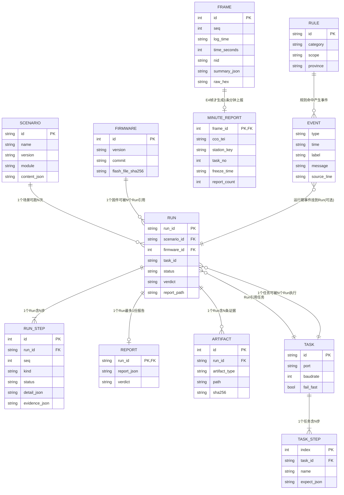
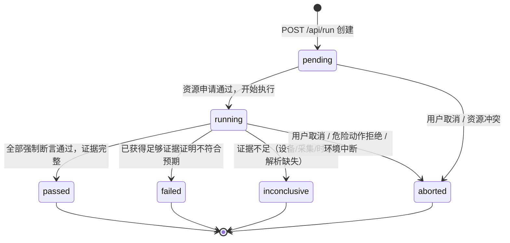
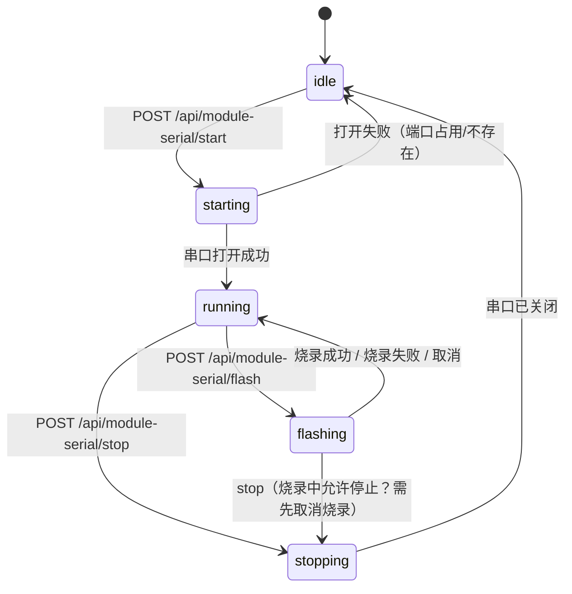
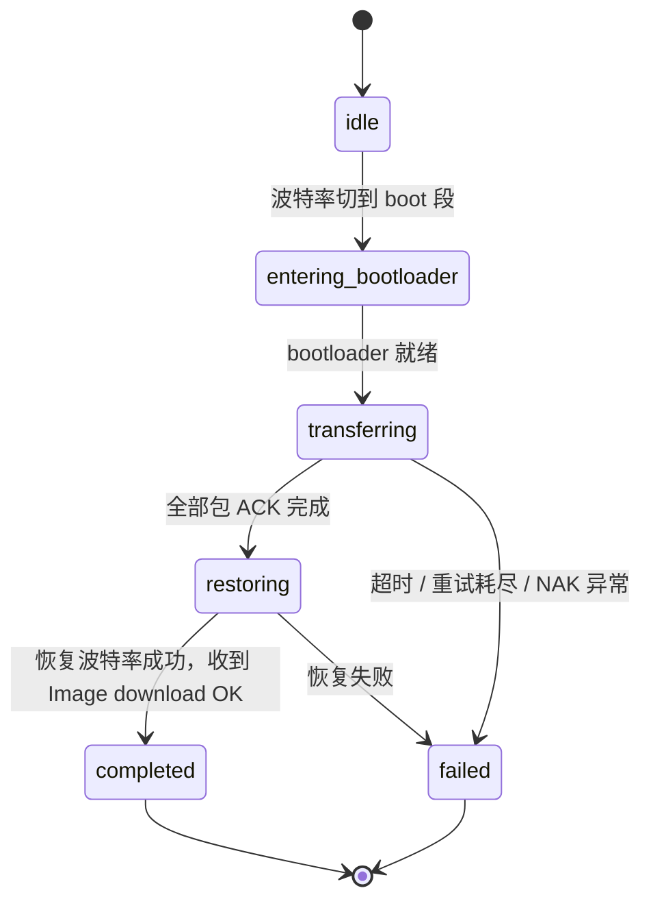
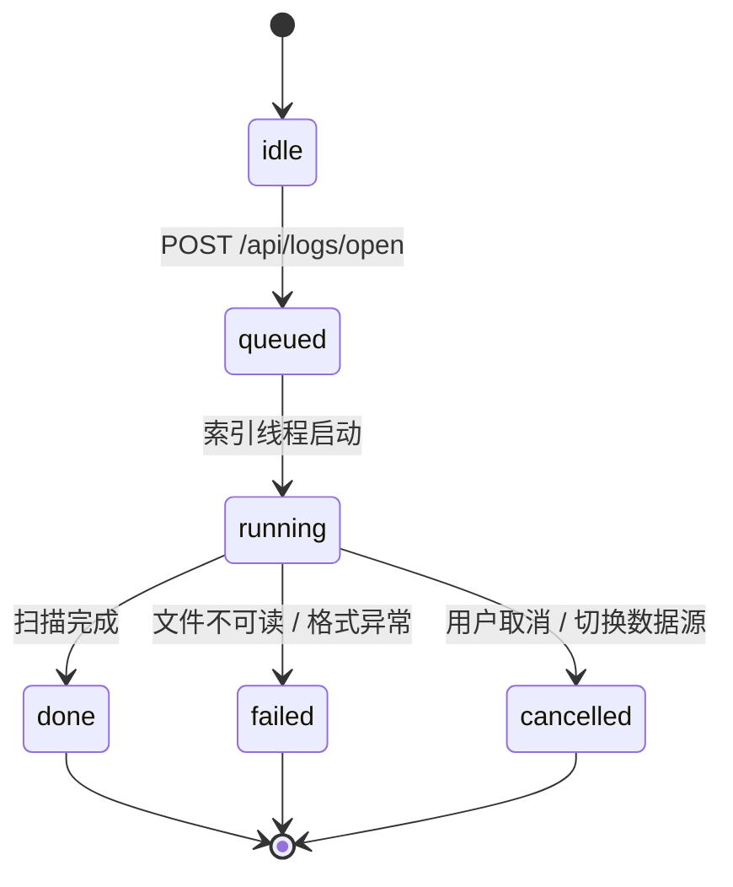
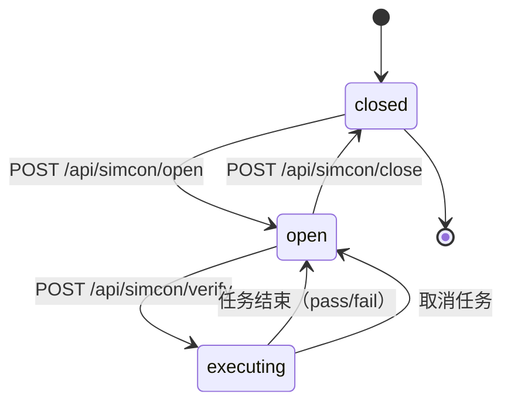
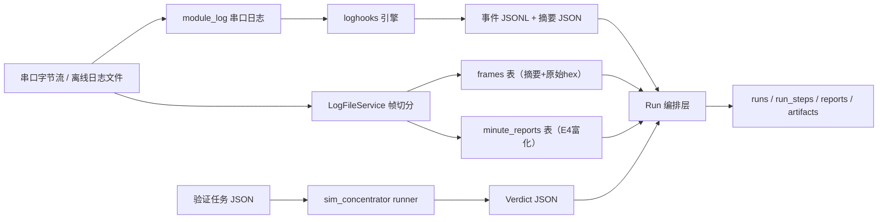

# 侦听台改造项目 —— 系统架构与核心模型设计（数据与接口契约）

> **文档定位**：给技术人员看的数据实体、ER 关系、状态机与接口契约。产品经理看 `需求文档.md` 的功能流程；本文件看“数据流向和实体关系”。
> **版本**：v1.0｜ **整理日期**：2026-08-15
> **配套交付物**：
> 1. 数据库建表 SQL：`docs/database/schema.sql`
> 2. 核心接口定义（Swagger/OpenAPI）：`docs/api/openapi.json`
> 3. 总体设计：`最终设计文档.md`；需求：`需求文档.md`

---

## 1. 核心实体总览

把产品里的“东西”抽象为以下实体：

| 实体 | 说明 | 主要属性 | 落库 |
|------|------|----------|------|
| Frame（帧） | 侦听台切出的一条 HPLC 帧 | id, seq, log_time, time_seconds, nid, summary_json, raw_hex | `frames` |
| MinuteReport（分钟采集上报） | E4 帧富化出的业务记录 | frame_id, cco_tei, station_key, task_no, freeze_time, report_count... | `minute_reports` |
| Event（事件） | loghooks 从日志/帧提取的关键运行状态 | type, time, label, message, source_line | 事件 JSONL（实时）/ scan 结果（离线） |
| Rule（规则） | loghooks 规则配置 | id, category, scope, province, match/sequence | JSON 文件（不落库） |
| Task（验证任务） | sim_concentrator 执行单元 | id, port, baudrate, fail_fast, steps | 任务 JSON |
| TaskStep（任务步骤） | 一个下发+期望 | send, expect, expect_no_reply, expect_timeout | 任务 JSON 内嵌 |
| Scenario（场景模板） | 平台级验证场景 | id, name, expected_flow, stimulus, monitor, timing | `scenarios` |
| Firmware（固件信息） | 烧录/验证的固件指纹 | version, commit, flash_file_sha256 | `firmware_infos` |
| Run（验证批次） | 一次闭环验证 | run_id, scenario_id, firmware_id, status, verdict, report_path | `runs` |
| RunStep（运行步骤） | Run 内一步 | run_id, seq, kind, status, detail_json, evidence_json | `run_steps` |
| Report（统一报告） | Run 的最终报告 | run_id, report_json, verdict | `reports` |
| Artifact（证据/产物） | 报告引用的原始证据 | run_id, artifact_type, path, sha256 | `run_artifacts` |
| FeedbackRule（归因规则） | 失败→归因建议 | rule_id, when_json, then_text | `feedback_rules` |
| SerialSession（串口会话） | module_log / simcon 的串口生命周期 | port, baudrate, state, flash_state | 运行时内存态（不落库） |

---

## 2. ER 图（实体关系图）

### 2.1 关系说明（全部定死）

| 关系 | 基数 | 外键/约束 |
|------|------|-----------|
| Scenario → Run | 1 : N | `runs.scenario_id` 引用 `scenarios.id`，禁止空 |
| Firmware → Run | 1 : N | `runs.firmware_id` 引用 `firmware_infos.id`，可空 |
| Task → Run | 1 : N（逻辑） | `runs.task_id` 存任务 id，任务本体为 JSON 文件，不做外键 |
| Run → RunStep | 1 : N | `run_steps.run_id` 引用 `runs.run_id`，级联删除 |
| Run → Report | 1 : 0..1 | `reports.run_id` 引用 `runs.run_id`，级联删除 |
| Run → Artifact | 1 : N | `run_artifacts.run_id` 引用 `runs.run_id`，级联删除 |
| Frame → MinuteReport | 1 : 0..1 | `minute_reports.frame_id` 引用 `frames.id`，级联删除；仅 E4 帧生成 |
| Rule → Event | 1 : N | 事件由规则命中产生，事件带 `rule_id` 字段（JSONL 内冗余） |
| Event → Run | N : 0..1 | 运行期事件通过 `run_id` 字段挂靠，离线扫描事件可为空 |

---

## 3. 状态机设计

### 3.1 Run 状态机（核心）

边界条件（防止逻辑漏洞）：

- `pending` 只允许流转到 `running` 或 `aborted`，不允许直接出结论。
- `running` 必须记录 `started_at`；`passed/failed/inconclusive/aborted` 必须记录 `finished_at`。
- `inconclusive` 与 `failed` 严格区分：拿到证据但不达标 = `failed`；没拿到足够证据 = `inconclusive`，不能算通过。
- `aborted` 后必须执行资源清理（串口/继电器释放），不得遗留“假运行中”。
- Report 只能在 `passed/failed/inconclusive` 三种终态生成；`aborted` 可只留 RunStep 记录，不生成 Report。

### 3.2 串口会话状态机（module_log）

### 3.3 XMODEM 烧录状态机

### 3.4 日志索引状态机（listener）

约束：`running` 与串口采集互斥；切换数据源必须先进入 `cancelled`/`done`，再回到 `idle`。

### 3.5 sim_concentrator 端口与任务状态机

任务内部：`pending → sending → waiting → matching → passed/failed`（逐步推进；`fail_fast=true` 时首步失败即 `fail`）。

---

## 4. 数据流向（技术视角）

关键规则：

1. **原始数据只写一次**：`frames.raw_hex` 与日志文件是原始证据，后续解析、事件、报告全部引用它们，不重写。
2. **富化结果可重算**：`frames.summary_json` 与 `minute_reports` 可由原始帧重算；损坏时可重建索引。
3. **报告不可变**：`reports.report_json` 一旦生成不再更新；Run 状态变化只更新 `runs` 表。
4. **证据链走 artifact 引用**：报告内只存 `artifacts` 路径与 sha256，不内嵌大文件。

---

## 5. 接口契约（RESTful 约定）

### 5.1 全局约定

| 项 | 约定 |
|----|------|
| 风格 | RESTful JSON；不引入 GraphQL |
| 版本 | 路径不显式带版本，版本体现在 `/api/version` 与文档版本 |
| 时间 | 统一 ISO8601 字符串（`2026-08-14T10:00:00+08:00`） |
| 错误 | 统一 `{ "code": "...", "message": "...", "detail": {} }` |
| 冲突 | 串口占用/数据源互斥统一返回 `409` |
| 校验 | 参数非法统一返回 `422` |
| 分页 | 列表统一 `offset/limit`，`limit` 默认 50、上限 500 |

### 5.2 核心接口清单

| 方法 | 路径 | 入参要点 | 出参要点 | 状态 |
|------|------|----------|----------|------|
| GET | `/api/version` | 无 | name, version | 现状 |
| POST | `/api/parse` | `{frame_hex}` | FrameDetail（summary/full/application） | 现状 |
| POST | `/api/logs/open` | `{path}` | state: queued/running | 现状 |
| GET | `/api/logs/status` | 无 | state, frame_count, progress | 现状 |
| GET | `/api/logs/frames` | offset, limit, nid, start, end, q | items, total | 现状 |
| GET | `/api/logs/frames/{id}` | id | FrameDetail | 现状 |
| GET | `/api/logs/minute-analysis` | period_minutes, cco_tei, deduplicate | MinuteAnalysisResult | 现状 |
| GET | `/api/module-serial/ports` | 无 | ports | 现状 |
| GET | `/api/module-serial/status` | 无 | state, flash | 现状 |
| POST | `/api/module-serial/start` | `{port, baudrate}` | state | 现状 |
| POST | `/api/module-serial/stop` | 无 | state | 现状 |
| POST | `/api/module-serial/flash` | `{bin_path, slot, baud_plan, no_reboot_after}` | flash_state | 现状 |
| POST | `/api/loghooks/scan` | `{paths, module, province, correlate}` | LoghooksScanResult | 现状 |
| GET | `/api/loghooks/sources` | 无 | sources | 现状 |
| GET | `/api/simcon/status` | 无 | port_state, task_id | 现状 |
| GET | `/api/simcon/ports` | 无 | ports | 现状 |
| GET | `/api/simcon/responders` | 无 | responders | 现状 |
| POST | `/api/simcon/open` | port, baudrate | state | 现状 |
| POST | `/api/simcon/close` | 无 | state | 现状 |
| POST | `/api/simcon/verify` | VerificationTask | Verdict | 现状 |
| POST | `/api/run` | `{scenario_id, firmware, parameters, skip_flash}` | Run | 目标 |
| GET | `/api/run/{run_id}` | run_id | Run | 目标 |
| GET | `/api/run/{run_id}/report` | run_id | Report | 目标 |
| GET | `/api/scenarios` | 无 | items: Scenario[] | 目标 |
| POST | `/api/compare` | `{expected_flow, actual_events}` | FlowCompareResult | 目标 |
| POST | `/api/feedback` | `{compare_result}` | items: Feedback[] | 目标 |
| GET | `/api/platform/status` | 无 | subapps 状态 | 目标 |
| GET | `/api/platform/pages` | 无 | pages 页签注册表 | 目标 |

### 5.3 前后端协作纪律

1. **先定接口，再各自开发**：以 `docs/api/openapi.json` 为唯一契约，任何字段变更必须更新契约并评审。
2. **出参字段只增不改**：新增字段向后兼容；破坏性变更必须升版本。
3. **前端不拼 SQL/不解析业务字节**：前端只消费后端结构化 JSON，原始帧/原始日志只做展示与回看。
4. **错误码稳定**：`409`（资源冲突）、`422`（参数校验）、`404`（不存在）、`500`（内部错误，不向前端暴露堆栈）。

---

## 6. 交付物清单

| 交付物 | 路径 | 说明 |
|--------|------|------|
| 数据库建表 SQL | `docs/database/schema.sql` | SQLite DDL：现状索引库 2 表 + 目标平台库 6 表 + 初始化数据 |
| 核心接口定义（Swagger JSON） | `docs/api/openapi.json` | OpenAPI 3.0.3，可直接导入 Swagger UI / YApi |
| 本文档 | `docs/系统架构与核心模型设计.md` | ER 图 + 状态机 + 接口清单 + 数据流 |

---

## 7. 后续执行建议

1. 用 `schema.sql` 在 `data/runs.sqlite` 初始化 platform 库；`frames/minute_reports` 沿用现有索引库，不做迁移。
2. 前端按 `openapi.json` 生成 TypeScript 类型（或人工对齐），后端按契约逐接口实现。
3. Run 状态机作为 platform 编排层单测用例（非法流转必须被拒绝）。
4. 每个新场景模板先补 `scenarios` 初始化数据，再补 compare/feedback 规则，最后端到端验收。
