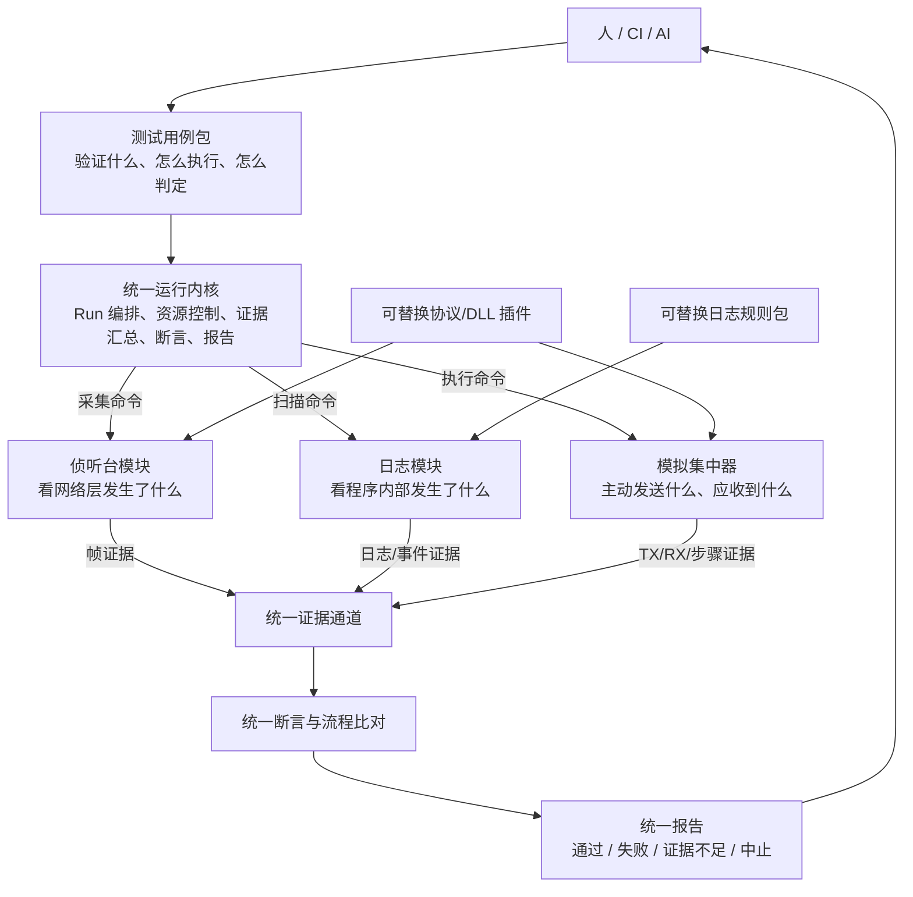
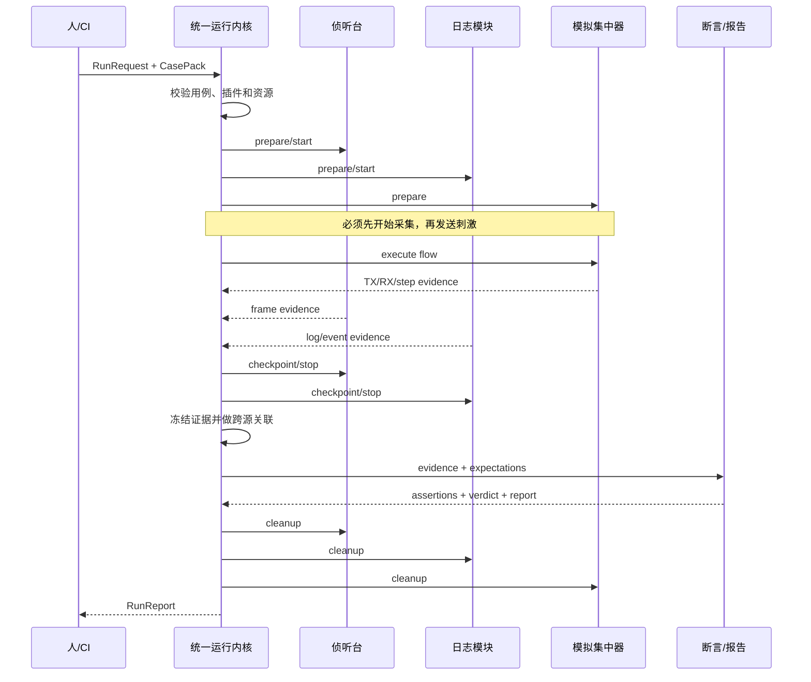

# 三源统一自动验证框架总体方案

- 文档日期：2026-08-16
- 文档性质：总体方案设计
- 本轮范围：只定义框架、模块职责、输入输出、交互协议和改进步骤，不修改业务代码
- 适用模块：侦听台、模块日志/loghooks、模拟集中器

## 1. 一句话方案

建立一个独立的“统一自动验证框架”：测试用例告诉框架要验证什么，统一运行内核负责调度；侦听台提供网络证据，日志模块提供运行逻辑证据，模拟集中器提供业务刺激和交互证据；框架统一做关联、断言和报告。

三个模块之间不直接互相调用。它们只与统一运行内核交互：

- 运行内核向模块发送命令；
- 模块向运行内核返回证据和执行结果；
- 最终结论只由运行内核产生。

## 2. 最容易理解的总体结构



读图时只需要记住四点：

1. 用例包是输入；
2. 三个模块是执行者和证据提供者；
3. 统一运行内核是总指挥；
4. 统一报告是输出。

## 3. 框架由哪些部分组成

### 3.1 控制入口

职责：让人、CI 或 AI 创建和查看一次验证。

首期直接沿用 `apps/workbench/`，不立即重命名为 `platform`。它只负责：

- 选择用例和参数；
- 创建、取消、查询 Run；
- 展示进度和报告；
- 查看原始证据。

控制入口不写协议解析规则，不写日志匹配规则，也不直接操作串口。

### 3.2 统一运行内核

建议目标位置：`libs/verification_core/`。

它是整个框架唯一的中心，负责：

- 加载和校验测试用例包；
- 把用例编译为可执行步骤；
- 申请和释放串口、设备、文件等资源；
- 按顺序调用三个模块；
- 为所有命令、步骤和证据分配 `run_id`、`step_id`；
- 汇总证据并做跨来源关联；
- 执行断言和流程比对；
- 生成并保存统一报告；
- 在失败、取消和异常时执行清理。

### 3.3 模块适配层

建议目标位置：`libs/verification_adapters/`。

适配层把现有模块包装成统一接口：

- `listener_adapter`：包装 `apps/listener/`；
- `log_adapter`：包装 `apps/module_log/` 和 `libs/loghooks/`；
- `simcon_adapter`：包装 `libs/sim_concentrator/`；
- `parser_adapter`：包装 `libs/parser_lib/` 和 C# DLL；
- `device_adapter`：以后包装烧录、继电器、电源等操作。

适配层存在的目的，是让统一运行内核不依赖现有模块内部类名、函数名和目录结构。

### 3.4 可替换资产

建议目标位置：`test_assets/`。

| 资产 | 作用 | 更换时是否改内核 |
|---|---|---|
| 测试用例包 | 定义验证目标、流程、断言和清理 | 否 |
| 协议插件 | 构帧、解帧、字段标准化 | 否 |
| DLL 插件 | 封装具体 DLL 路径、入口和返回结构 | 否 |
| 日志规则包 | 将日志转换为事件和状态序列 | 否 |
| golden 数据 | 离线回放帧、日志和交互 | 否 |

## 4. 每个模块到底做什么

### 4.1 侦听台模块

#### 定位

旁路观察者。只回答“网络层实际发生了什么”，不负责主动驱动测试流程。

#### 输入

`ListenerRequest`：

| 字段 | 含义 |
|---|---|
| `run_id`、`step_id` | 本次运行和步骤标识 |
| `source` | 串口、日志文件或 golden 回放 |
| `window` | 采集开始/结束条件和超时 |
| `filters` | 方向、MAC、NID、报文 ID、任务号等筛选条件 |
| `parser_capability` | 需要的解析能力，不直接写 DLL 名称 |
| `extract` | 需要提取的字段和统计项 |

#### 内部处理

```text
读取字节流或日志
  → 切帧和索引
  → 轻量筛选
  → 调用指定协议/DLL 插件
  → 标准化解析结果
  → 生成帧证据和统计证据
```

#### 输出

- 原始帧引用；
- 帧时间、方向、地址、报文 ID 等摘要；
- 标准化协议字段；
- 帧数量、覆盖率、重复、缺失等统计；
- 解析失败、数据截断、未知字段等质量说明；
- `EvidenceEnvelope[]` 和 `ModuleResult`。

#### 不做什么

- 不直接判定整个用例是否通过；
- 不调用日志模块；
- 不调用模拟集中器；
- 不把某个 DLL 接口暴露给用例包。

#### 改进方向

将现有采集、切帧、解析、统计拆成独立能力；用 `parser_capability` 选择解析插件；实时采集和离线回放输出完全相同的证据结构。

### 4.2 日志模块

#### 定位

内部逻辑观察者。只回答“模块代码运行到了什么状态、发生了什么事件”。

#### 输入

`LogRequest`：

| 字段 | 含义 |
|---|---|
| `run_id`、`step_id` | 本次运行和步骤标识 |
| `sources` | CCO、STA 或其他日志文件/实时流 |
| `rule_pack` | 规则包 ID 和版本 |
| `window` | 扫描范围和时间窗口 |
| `context` | 固件版本、省份、模块类型等规则上下文 |
| `correlation_keys` | NID、MAC、TEI、任务号、冻结时刻等关联键 |

#### 内部处理

```text
读取实时或离线日志
  → 标准化日志行
  → 文本/正则/结构化规则匹配
  → 跨行序列状态机
  → 产生事件
  → 绑定原始日志行和业务关联键
```

#### 输出

- 原始日志行引用；
- 标准事件，如入网开始、入网成功、分钟采集上报、错误；
- 序列步骤完成、超时、乱序和负向事件；
- 规则 ID、规则版本和命中位置；
- 日志完整性、时间精度和规则覆盖说明；
- `EvidenceEnvelope[]` 和 `ModuleResult`。

#### 不做什么

- 不根据单条日志直接给整个用例判通过；
- 不硬编码某个工程的全部打印文本；
- 不调用侦听台或模拟集中器；
- 不修改模块工程代码。

#### 改进方向

规则和引擎彻底分离；规则包显式绑定固件/地区版本；实时扫描和离线扫描走同一引擎；序列规则支持可选步骤、循环、负向断言和时序约束。

### 4.3 模拟集中器模块

#### 定位

主动刺激者。回答“指定流程下应该发送什么、实际收到了什么、单个交互步骤是否符合预期”。

#### 输入

`SimulationRequest`：

| 字段 | 含义 |
|---|---|
| `run_id`、`step_id` | 本次运行和步骤标识 |
| `flow_plan` | 流程步骤和参数 |
| `transport` | 串口或离线模拟通道 |
| `codec_capability` | 构帧/解帧能力 |
| `responders` | 自动应答规则 |
| `timeouts` | 步骤超时、重试和总超时 |
| `cleanup` | 失败或取消后的复位动作 |

#### 内部处理

```text
加载流程
  → 调用 codec 构帧
  → 发送 TX
  → 监听 RX
  → 解帧和匹配
  → 触发应答
  → 记录步骤结果
  → 无论成功失败都执行清理
```

#### 输出

- 每一步实际发送的原始帧；
- 每一步收到的原始帧；
- 匹配、超时、重试、无响应和清理结果；
- 标准化字段和交互耗时；
- `EvidenceEnvelope[]` 和 `ModuleResult`。

#### 不做什么

- 不解析模块内部日志；
- 不代替侦听台证明旁路网络层真实情况；
- 不独立生成最终业务结论；
- 不把 1376.2 固定为框架唯一协议。

#### 改进方向

流程与执行器分离；流程只引用动作和 codec capability；支持 `send`、`expect`、`expect_no_reply`、`optional`、`repeat_until`、`cleanup`；更换协议时替换 codec 插件。

### 4.4 统一运行内核

#### 定位

总指挥和唯一最终裁判。

#### 输入

- `RunRequest`：用例 ID、用例版本、运行参数、设备配置和固件信息；
- `CasePack`：流程、证据需求、断言、超时和清理动作；
- 插件目录：当前可用的模块、协议、DLL、规则和设备能力。

#### 输出

- Run 状态和步骤进度；
- 完整证据索引；
- 断言结果和流程差异；
- `RunReport`；
- CLI 退出码和 API 状态。

## 5. 输入和输出的总关系

| 输入到哪里 | 输入 | 输出 | 输出给谁 |
|---|---|---|---|
| 统一运行内核 | `RunRequest + CasePack` | `CompiledPlan` | 内核运行器 |
| 侦听台 | `ListenerRequest` | 帧/统计证据 | 证据通道 |
| 日志模块 | `LogRequest` | 日志/事件证据 | 证据通道 |
| 模拟集中器 | `SimulationRequest` | TX/RX/步骤证据 | 证据通道 |
| 断言引擎 | 期望条件 + 全部证据 | `AssertionResult[]` | 报告生成器 |
| 报告生成器 | Run、步骤、证据、断言 | `RunReport` | 人、CI、AI |

## 6. 模块怎么交互

### 6.1 交互硬规则

```text
允许：运行内核 → 模块适配器
允许：模块适配器 → 统一证据通道
允许：报告/断言层读取统一证据

禁止：侦听台 → 日志模块
禁止：日志模块 → 模拟集中器
禁止：模拟集中器 → 侦听台
禁止：用例包 → 具体 DLL 函数
```

这样做以后，替换一个模块不会迫使另外两个模块修改。

### 6.2 两条逻辑通道

#### 命令通道

运行内核向模块发送：

- `prepare`：准备资源；
- `start`：开始采集或执行；
- `checkpoint`：记录证据边界；
- `stop`：停止并冻结结果；
- `cancel`：取消；
- `cleanup`：清理和复位；
- `health`：健康检查。

#### 证据通道

模块向内核发送：

- `frame`：网络帧；
- `log_line`：原始日志行；
- `event`：规则识别事件；
- `interaction`：模拟集中器 TX/RX；
- `operation`：烧录、串口、清理等操作；
- `module_result`：模块局部执行结果；
- `error`：技术异常和质量限制。

### 6.3 自定义消息协议

所有跨边界消息统一使用 `VerificationMessage v1`：

```json
{
  "protocol": "verification-message",
  "version": "1.0",
  "message_id": "msg-001",
  "correlation_id": "run-001/step-003",
  "kind": "command|evidence|result|error|heartbeat",
  "type": "listener.start|log.event|simcon.tx|assert.result",
  "created_at": "2026-08-16T14:00:00.123+08:00",
  "payload": {},
  "artifact_ref": null,
  "error": null
}
```

第一阶段不必为所有模块建设网络服务：

- 同进程 Python 模块使用类型化接口和内存事件队列；
- 消息仍必须能序列化为上述 JSON；
- DLL 和容易崩溃的解析器使用独立进程，通过 JSONL/stdin-stdout 传输；
- 以后需要远程执行时，可换成 WebSocket 或 HTTP，不修改消息语义。

大帧、大日志和二进制文件不放进消息体，只传 `artifact_ref + sha256`。

## 7. 统一证据格式

```json
{
  "evidence_id": "ev-001",
  "run_id": "run-001",
  "step_id": "step-003",
  "source": "listener|module_log|simcon|device",
  "kind": "frame|log_line|event|interaction|operation",
  "captured_at": "2026-08-16T14:00:00.123+08:00",
  "monotonic_ns": 123456789,
  "artifact_ref": "runs/run-001/artifacts/listener/0001.bin",
  "artifact_sha256": "...",
  "parsed": {},
  "correlation": {
    "task_no": "1",
    "sta_mac": "...",
    "nid": "..."
  },
  "quality": {
    "complete": true,
    "clock_precision_ms": 10,
    "warnings": []
  }
}
```

任何失败和通过结论都必须引用一个或多个 `evidence_id`。

## 8. 一次完整验证怎么运行



标准顺序：

1. 校验用例和插件；
2. 申请串口、设备和文件资源；
3. 启动侦听与日志证据窗口；
4. 模拟集中器执行刺激流程；
5. 等待应答、事件和统计窗口；
6. 停止并冻结三类证据；
7. 按任务号、MAC、NID 和单调时间关联；
8. 执行字段、事件、时序、覆盖率和负向断言；
9. 生成统一报告；
10. 清理并释放所有资源。

## 9. 最终报告怎么判

统一报告只有四种最终状态：

| 状态 | 含义 |
|---|---|
| `passed` | 所有必需证据存在且断言通过 |
| `failed` | 证据完整，但业务行为不符合期望 |
| `inconclusive` | 没采到数据、数据不完整、解析器不可用、时钟不可信或规则未覆盖 |
| `aborted` | 人工取消、资源失败或框架异常导致运行中止 |

必须区分“业务失败”和“系统没有能力判断”。没有证据不能判通过，也不能直接判业务失败。

报告内容分三层：

1. 总览：结论、失败步骤、影响范围；
2. 时间线：模拟 TX/RX、网络帧、模块事件在同一时间轴上展示；
3. 原始证据：帧 hex、解析字段、日志行、规则版本和文件哈希。

## 10. 推荐目录骨架

```text
apps/
└── workbench/                       # 现有统一入口，首期保留名称

libs/
├── verification_contracts/          # 稳定数据契约
│   ├── case.py
│   ├── run.py
│   ├── message.py
│   ├── evidence.py
│   ├── plugin.py
│   ├── report.py
│   └── schemas/
├── verification_core/               # 与具体协议无关的运行内核
│   ├── catalog.py
│   ├── compiler.py
│   ├── orchestrator.py
│   ├── resources.py
│   ├── evidence_bus.py
│   ├── correlator.py
│   ├── assertions.py
│   ├── flow_compare.py
│   ├── artifacts.py
│   └── report_builder.py
├── verification_adapters/           # 现有模块的统一包装
│   ├── listener_adapter.py
│   ├── log_adapter.py
│   ├── simcon_adapter.py
│   ├── parser_adapter.py
│   └── device_adapter.py
├── loghooks/                         # 保留现有业务能力
├── sim_concentrator/                 # 保留现有业务能力
├── parser_lib/                       # 保留现有业务能力
└── shared/

test_assets/
├── cases/
├── rule_packs/
├── protocol_packs/
└── fixtures/golden/

data/runs/<run_id>/
├── manifest.json
├── evidence.jsonl
├── artifacts/
├── report.json
├── report.html
└── report.md
```

## 11. 接下来的改进步骤 1～5

### 任务 1：冻结统一契约

#### 目标

先规定所有模块共同使用的语言，暂时不重构模块业务逻辑。

#### 设计产物

- `CasePack`、`RunRequest`、`CompiledPlan`；
- `VerificationMessage`、`EvidenceEnvelope`；
- `ModuleResult`、`AssertionResult`、`RunReport`；
- 插件清单和 capability 规则；
- v1 JSON Schema 和示例数据。

#### 验收出口

- 同一份证据可被写入 JSONL 并重新读取；
- 三个模块的示例输出都能转换成 `EvidenceEnvelope`；
- schema 能拒绝缺少 `run_id`、`source`、`artifact_ref` 等关键字段的数据；
- 契约中不存在国网、南网、安徽或某个 DLL 的硬编码字段。

### 任务 2：完成三个模块适配器

#### 目标

不改变现有模块主要功能，让它们以统一方式接收请求、输出证据。

#### 子任务

1. 侦听台适配器：离线日志/golden 输入 → 帧证据；
2. 日志适配器：日志 + 规则包 → 事件证据；
3. 模拟集中器适配器：离线 transport + flow → TX/RX/步骤证据；
4. 解析器适配器：Python 解析器和 DLL 都映射到同一 capability。

#### 验收出口

- 三个适配器可以独立运行；
- 三者不互相 import；
- 全部输出使用相同证据格式；
- 使用 golden 数据时不依赖硬件；
- 替换规则包或解析插件时适配器接口不变。

### 任务 3：建立统一 Run 运行内核

#### 目标

让一次 Run 能真正编排三个适配器。

#### 设计内容

- 用例加载和 DSL 编译；
- Run 状态机；
- 串口和设备资源租约；
- 证据总线和 artifact 存储；
- 取消、超时、失败清理；
- 跨来源业务键和时间关联。

#### 验收出口

- 使用假适配器可跑完一整个 Run；
- 采集一定发生在刺激之前；
- 失败、取消和异常都执行 cleanup；
- 相同输入可离线回放并得到相同证据序列；
- 所有产物按 `run_id` 归档。

### 任务 4：建立统一断言和报告

#### 目标

把人工逐帧、逐行、逐步骤判断转成统一规则。

#### 设计内容

- 帧字段断言；
- 日志事件和状态断言；
- TX/RX 匹配断言；
- 缺失、超时、乱序和负向触发；
- 统计覆盖率断言；
- `passed/failed/inconclusive/aborted` 聚合；
- JSON、HTML、Markdown 报告。

#### 验收出口

- 每条断言都能下钻到 `evidence_id`；
- 四类流程差异均有测试样本；
- 无数据被判为 `inconclusive`，不误判为 `failed`；
- 人只看报告首页即可掌握结论，失败项可下钻原始证据。

### 任务 5：跑通真实用例并证明可替换

#### 目标

用真实业务证明框架不是又一个与项目耦合的专用工具。

#### 首个用例

建议选择“安徽分钟采集”，因为它同时覆盖：

- 模拟集中器配置和接收；
- 侦听台网络帧；
- CCO/STA 模块日志；
- 协议字段；
- 跨来源时序；
- 汇总报告。

#### 必须完成的替换证明

1. 替换一个测试用例包，运行内核不改；
2. 替换一套日志规则包，日志引擎不改；
3. 替换一个协议解析插件或假 DLL，侦听台适配器不改；
4. 使用 offline/golden 和真实串口两种输入，报告结构不变；
5. 从 workbench 和 CLI 启动同一用例，Run 结果一致。

#### 验收出口

同一个 `run_id` 中能看到模拟集中器 TX/RX、侦听帧、模块事件、断言和统一报告；上述五项替换证明全部成立后，才认为框架骨架完成。

## 12. 五个任务之间的关系


不可跳过任务 1 直接做任务 3。否则 Run、证据和报告模型会继续跟着某个模块变化，最终再次耦合。

任务 2 中的侦听、日志、模拟集中器三个适配器可以在契约冻结后并行设计，但必须各自通过合同测试后才能接入任务 3。

## 13. 当前建议立即确定的决策

### 决策 1：统一入口名称

建议首期继续使用 `apps/workbench`，先稳定接口和运行内核；产品稳定后再评估是否重命名为 `platform`。

### 决策 2：首期通信方式

建议 Python 模块同进程运行，统一消息可 JSON 序列化；DLL 解析器独立进程隔离。暂不为每个模块单独建设 HTTP 服务。

### 决策 3：首个用例

建议确定“安徽分钟采集”为首个端到端用例，同时准备一套完全离线的 golden 数据，先在无硬件环境跑通，再接真实串口。

### 决策 4：存储方式

建议：SQLite 只保存 Run、Step 和索引元数据；证据使用 JSONL；原始帧、日志和大对象使用独立 artifact 文件；报告使用 JSON + HTML + Markdown。

### 决策 5：结论责任

最终 verdict 只能由确定性断言产生。AI 可以摘要、归因和提出建议，但不能绕过证据把用例判为通过。

## 14. 本方案的最终效果

完成后，新增协议、地区或业务验证的工作方式应变为：

```text
安装/升级协议插件
  + 安装日志规则包
  + 安装测试用例包
  + 选择运行参数
  → 执行统一 Run
  → 查看统一报告
```

不需要修改统一运行内核，不需要让三个模块互相了解，也不需要人工把三份结果放在一起比对。

人在日常验证中的主要职责从“逐帧、逐日志、逐步骤检查”变成：

1. 选择正确的用例和环境；
2. 查看最终结论与证据完整性；
3. 对失败或证据不足项进行必要复核；
4. 审批涉及烧录、继电器和真实设备的危险动作。
