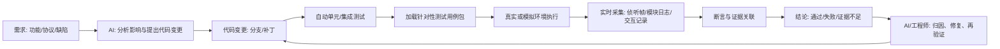
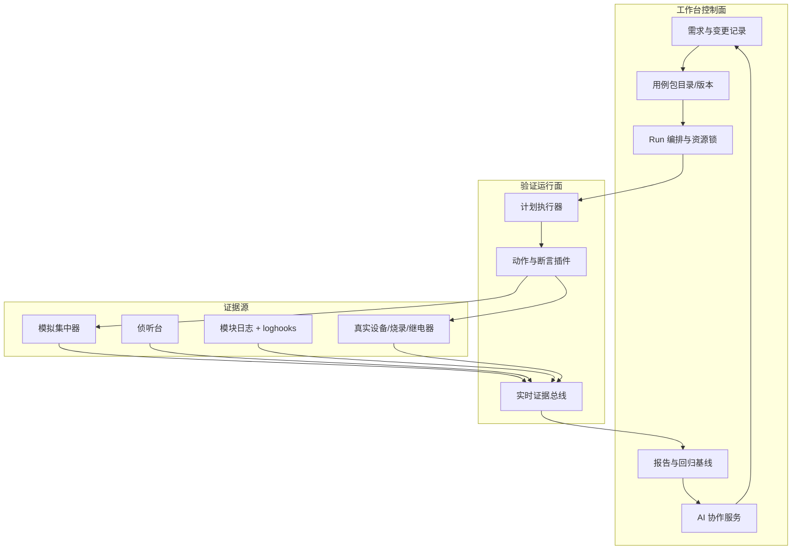
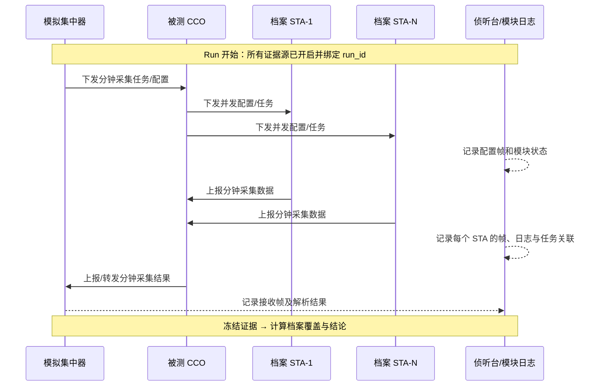

# AI 需求驱动研发验证闭环平台设计

> 状态：目标架构设计  
> 版本：v1.0  
> 日期：2026-08-15  
> 关联文档：[产品设计](../产品设计/侦听台产品设计文档.md)、[GW-CASS 迁移设计](GW-CASS自动化验证能力迁移与统一工作台设计.md)

## 1. 最终解决方案

本项目最终不是一个“侦听台 + 模块日志 + 模拟集中器的页面集合”，而是一套由 AI 辅助迭代的**需求—代码—验证—证据—结论闭环平台**。

从一个研发需求开始，平台应能做到：



AI 可以参与分析、代码修改、测试生成、证据摘要和失败归因；但任何“通过”的结论必须由版本化测试用例、实际执行记录和原始证据支撑，而不是 AI 的文字判断。涉及烧录、继电器、真实设备操作和代码合入时，必须保留人或策略引擎的授权闸门。

## 2. 核心产品抽象：可加载测试用例包

**测试用例包**是平台的最小可交付验证单元。每次开发不需要修改工作台底层代码，只需要新增或升级对应的用例包；工作台加载后就能执行、采集证据和输出统一结论。

一个用例包必须同时声明四类内容：

| 内容 | 作用 | 示例 |
|---|---|---|
| 需求与范围 | 说明验证什么、适用版本、前置条件 | “安徽分钟采集：配置后所有档案 STA 上报，CCO 向集中器转发” |
| 交互刺激 | 模拟集中器向 CCO 下发什么、如何应答、如何接收上报 | 配置任务、发送并发配置、接收分钟上报 |
| 证据采集 | 从哪些 listener / module log / simcon 流中采集什么证据 | CCO 下发帧、STA 上报帧、CCO 模块状态、集中器接收记录 |
| 断言和结论 | 如何判定通过、失败、证据不足 | 覆盖全部档案 STA、字段匹配、时序正确、无错误事件 |

### 2.1 用例包目录结构

```text
test_assets/cases/
└── anhui-minute-collection/
    ├── case.yaml                 # 用例元数据、适用范围、入口计划
    ├── plan.yaml                 # 可执行步骤、断言、超时、清理动作
    ├── roster.schema.json        # STA 档案清单格式
    ├── parameters.schema.json    # 地址、周期、任务号等运行参数格式
    ├── simcon/
    │   ├── interactions.yaml     # 集中器↔CCO 交互脚本与应答规则
    │   └── frame_templates.yaml  # 可复用构帧模板
    ├── listener/
    │   ├── filters.yaml          # 侦听帧筛选和字段提取规则
    │   └── assertions.yaml       # 帧级断言
    ├── loghooks/
    │   └── rules.yaml            # 该用例专有的日志事件/状态机规则
    ├── fixtures/
    │   ├── golden/               # 已审定帧和日志样本
    │   └── fake-roster.json      # 无硬件测试档案
    └── README.md                  # 设备拓扑、接线、人工检查点、已知限制
```

用例包应以声明式 JSON/YAML 为主，加载时执行 schema 校验和内容哈希。**不允许把用户上传的任意 Python 代码直接作为测试步骤执行。**需要新能力时，通过受版本控制的动作插件或设备适配器扩展。

### 2.2 用例包与开发需求的关系

| 开发变化 | 用例包处理方式 |
|---|---|
| 修改现有分钟采集逻辑 | 复用并升级 `anhui-minute-collection` 的版本，新增对应断言或 golden 样本 |
| 新增协议命令 | 新增小型查询/设置用例包，或扩展已有协议包的 plan |
| 修改模块日志输出 | 更新该用例包的 `loghooks` 规则与证据断言，保留旧规则用于版本兼容比对 |
| 新增省份/地区流程 | 继承基础用例包，覆写参数、帧模板、事件规则和断言 |
| 需要外设动作 | 引入受控的继电器/可控电源适配器，并在用例中显式声明风险和清理动作 |

## 3. 分层架构



### 3.1 工作台控制面

- **需求与变更记录**：关联需求 ID、代码提交、固件版本、用例包版本与 Run。
- **用例目录**：管理用例包的安装、校验、版本、标签、自动化状态和适用范围。
- **Run 编排**：创建一次独立执行，申请设备资源、传递参数、控制取消、协调实时证据窗口。
- **报告与基线**：保存结构化结果，支持同一用例跨固件/提交/设备的回归比较。
- **AI 协作服务**：从需求生成改动建议、测试计划草案、失败摘要；不替代断言和证据。

### 3.2 验证运行面

- **计划执行器**：把 `plan.yaml` 编译为 setup、stimulus、wait、assert、cleanup 等步骤。
- **动作插件**：协议下发、接收应答、烧录、继电器、等待设备就绪、人工检查点。
- **断言插件**：帧字段、无响应、事件、时序、档案覆盖、聚合统计。
- **实时证据总线**：在动作发生前打开采集窗口，为所有证据打上 `run_id`、`step_id`、来源、时间和原始引用。

### 3.3 证据源

| 来源 | 当前能力 | 在目标架构中的职责 |
|---|---|---|
| `sim_concentrator` | 1376.2 构帧、应答、任务执行 | 主动下发和接收 CCO 上报；记录每个 TX/RX 原始帧 |
| `listener` | 串口/离线帧采集、解析、分钟报表 | 获取链路侧真实帧，筛选并富化协议字段 |
| `module_log + loghooks` | 实时日志、事件规则、状态机 | 将 CCO/STA 打印转换为时序事件，并保留原始行 |
| 设备适配器 | 烧录、串口、继电器基础能力 | 进行受控设备操作并产生操作证据 |

## 4. Run 的正确运行时序

当前 `apps/workbench/orchestration/runner.py` 的顺序是“离线扫描日志 → 下发激励 → 比对”，不适合证明一次真实测试发生的完整过程。目标 Run 必须以**先采集、后激励、再等待、最终冻结证据**为原则：

```text
预检查
  → 申请设备/端口资源
  → 记录配置与时间基准
  → 启动 listener / module log / simcon 证据订阅
  → 记录采集起点 checkpoint
  → 执行 setup 与刺激步骤
  → 等待应答、事件、统计窗口完成
  → 记录采集终点 checkpoint
  → 冻结原始证据与解析结果
  → 对证据运行断言
  → 生成通过/失败/证据不足结论
  → 清理设备状态并释放资源
```

所有证据都要携带以下最少字段：

```json
{
  "evidence_id": "ev-...",
  "run_id": "run-...",
  "step_id": "sta-minute-report",
  "source": "listener|module_log|simcon|device",
  "captured_at": "2026-08-15T20:00:00.123+08:00",
  "monotonic_ns": 0,
  "raw_ref": "artifacts/run-.../listener/000023.jsonl",
  "parsed": {},
  "correlation": {"task_no": "1", "sta_mac": "...", "nid": "..."}
}
```

时间关联以 Run 内单调时钟为主，设备日志时间、串口时间仅作为辅助显示；时钟未校准时结论必须标记时间精度限制。

## 5. 分钟采集用例：端到端设计样例

### 5.1 业务目标

验证一次分钟采集配置是否真正闭环：

1. 模拟集中器向 CCO 下发分钟采集配置。
2. CCO 根据档案清单，向每个已配置 STA 下发并发/任务配置。
3. 每个目标 STA 在规定窗口内生成并向 CCO 上报分钟采集数据。
4. CCO 将聚合或转发后的数据上报给模拟集中器。
5. 模块日志、侦听帧和模拟集中器交互能相互印证。
6. 平台能给出“全部成功、部分 STA 缺失、CCO 未转发、协议字段异常、证据不足”等明确结论。

角色关系由用例参数决定，避免写死特定串口或地址：



### 5.2 运行参数与档案清单

用例运行时必须输入或选择一个版本化档案清单，而不是从日志推测“应该有多少 STA”。

```json
{
  "roster_id": "lab-anhui-20260815",
  "cco": {"id": "cco-01", "address": "..."},
  "stas": [
    {"id": "sta-01", "mac": "001122334455", "tei": "001", "enabled": true},
    {"id": "sta-02", "mac": "001122334466", "tei": "002", "enabled": true}
  ],
  "expected_count": 2
}
```

用例启动前校验：启用 STA 的 MAC/TEI 唯一；目标 CCO 和档案版本明确；串口和角色拓扑无冲突；采集周期、任务号、时间窗均已给定。

### 5.3 分钟采集计划骨架

```yaml
id: anhui.minute-collection.v1
case_id: anhui.minute-collection
resources:
  - {id: simcon.cco, mode: exclusive}
  - {id: listener.hplc, mode: observer}
  - {id: module-log.cco, mode: observer}
parameters:
  roster: ${input.roster}
  task_no: ${input.task_no}
  period_minutes: ${input.period_minutes}
setup:
  - {id: start-evidence, action: evidence.start}
  - {id: flush-ports, action: device.flush}
steps:
  - id: configure-cco
    action: simcon.send_minute_config
    expect:
      - {type: simcon.frame, name: cco_config_ack, within_ms: 5000}
      - {type: listener.frame, name: cco_config_rx, within_ms: 5000}
  - id: distribute-to-stas
    action: evidence.wait_for_roster_frames
    with: {direction: cco_to_sta, roster: ${parameters.roster}}
    expect:
      - {type: roster.coverage, subject: config_dispatch, equals: all, within_ms: 30000}
      - {type: event, event_type: collect.minute.config.dispatched, count: ${parameters.roster.expected_count}}
  - id: sta-minute-report
    action: evidence.wait_for_roster_frames
    with: {direction: sta_to_cco, roster: ${parameters.roster}}
    expect:
      - {type: roster.coverage, subject: minute_report, equals: all, within_ms: 90000}
      - {type: frame_field, path: application.task_no, equals: ${parameters.task_no}}
      - {type: event_absent, event_type: collect.minute.parse_error}
  - id: cco-forward-report
    action: simcon.wait_report
    expect:
      - {type: simcon.frame, name: cco_minute_report, within_ms: 30000}
      - {type: aggregation, source: sta_to_cco, target: cco_to_concentrator, equals: roster}
cleanup:
  - {id: freeze-evidence, action: evidence.freeze}
  - {id: release-resources, action: resource.release}
```

### 5.4 证据矩阵与结论规则

| 结论点 | 直接证据 | 辅助证据 | 失败分类 |
|---|---|---|---|
| CCO 收到配置 | 模拟集中器 TX 与 CCO 配置 ACK | listener 下行/模块日志配置事件 | 配置未送达、ACK 异常、证据不足 |
| CCO 向全部档案 STA 下发 | listener 的 CCO→STA 配置帧，按 roster MAC/TEI 对齐 | CCO 日志的任务下发事件 | 某 STA 未下发、地址不匹配、重复下发 |
| 每个 STA 上报分钟数据 | listener 的 STA→CCO E4/对应分钟采集帧 | STA/CCO 日志事件、字段解析 | 某 STA 缺失、任务号错、超时、重复/异常数据 |
| CCO 向集中器上报 | 模拟集中器 RX 的 CCO 上报帧 | listener 和 CCO 日志 | 未转发、数量不一致、字段不一致 |
| 全链路一致 | 同一 `task_no + STA MAC + 时间窗` 三源关联 | NID/TEI/冻结时间锚点 | 关联失败、时钟偏差、解析不完整 |

结论不是二值。`Run` 应至少输出：

- `passed`：所有强制断言通过，证据完整。
- `failed`：已获得足够证据证明协议、流程、覆盖或字段不符合预期。
- `inconclusive`：设备/采集/时钟/解析缺失导致不能可靠判断，不能算通过。
- `aborted`：人为取消、资源冲突、危险动作拒绝或环境中断。

## 6. AI 在闭环中的职责与边界

### 6.1 AI 应执行的工作

- 从需求和既有用例中定位受影响协议、代码、规则和用例包。
- 生成代码变更草案、单元测试和用例包变更草案。
- 在模拟环境中执行单测、Golden 回放和静态校验。
- 根据结构化失败、帧解析和日志事件生成归因建议。
- 生成可审阅的验证摘要，链接到实际证据。

### 6.2 AI 不应自行宣称的工作

- 在没有真实 Run 证据时，不能宣称“现场功能通过”。
- 未经授权不能烧录、控电、切换继电器、占用真实设备串口或合并代码。
- 不能把猜测的协议字段、日志规则或 STA 档案补齐后当成事实。
- 不能把无法自动化的人工步骤标记为通过。

### 6.3 推荐的 AI 变更循环

```text
需求 → 影响分析 → 变更提案 → 人工/策略批准
  → 独立工作区改代码 → 单元测试
  → 生成/更新用例包 → 模拟回归
  → 申请真实设备 Run → 收集证据
  → 结构化结论 → 人工审阅/合并
```

每次 Run 报告至少关联：需求 ID、代码 commit、固件版本和哈希、用例包 ID/版本/内容哈希、参数集/档案清单版本、设备拓扑、原始证据清单。

## 7. 当前项目的缺口

| 当前已有能力 | 不能满足的地方 | 必须补齐 |
|---|---|---|
| `Run`、`RunStep`、`Report`、SQLite 归档 | 只有粗粒度 flash/monitor/stimulus/compare，不支持用例包和证据步骤 | 用例包模型、计划编译器、细粒度 RunStep、断言和 evidence 引用 |
| `sim_concentrator.execute_task` | 只能顺序 `send → expect`，不能根据档案并发等待多 STA、统计覆盖、关联上报 | 多角色交互、异步帧路由、roster 覆盖断言、脚本化应答 |
| `listener` 和分钟统计 | 能解析和聚合日志，但没有 Run 窗口和实时证据订阅 | checkpoint、Run 标签、选择性帧流、可被断言消费的结构化事件 |
| `module_log + loghooks` | 有日志和离线/实时扫描，但与一次验证 Run 缺少绑定 | Run 会话、实时事件订阅、专属用例规则加载和证据引用 |
| 场景 JSON | 只描述 `expected_flow`，且部分 `task_file` 对应目录不存在 | 用例包目录、schema、版本、参数集、计划和 fixtures |
| 报告 | 可输出概述与流程差异 | 不能还原“哪一条帧、哪一行日志、哪个 STA”支撑结论 | evidence graph、档案覆盖表、失败聚类和导出 |
| AI 归因文本 | 当前只是规则反馈 | 没有需求—代码—用例—Run 的可追溯工作流 | 变更记录、Agent 任务、批准闸门和回归策略 |

## 8. 工作台信息架构

统一工作台应从当前的“模块页签”升级为两层：

```text
研发验证工作台
├── 验证中心
│   ├── 用例库                # 加载、安装、版本、自动化状态
│   ├── 运行配置              # 设备拓扑、档案、参数、固件、代码版本
│   ├── 实时 Run              # 步骤、帧、事件、断言、资源状态、取消
│   └── 报告与回归            # 结论、证据、对比、导出
├── 诊断工具
│   ├── 侦听台
│   ├── 模块日志
│   ├── 对照解析
│   └── 模拟集中器
└── AI 协作
    ├── 需求影响分析
    ├── 变更与测试草案
    └── 失败归因与修复建议
```

诊断工具仍可独立使用；验证中心通过正式的适配器和资源管理调用它们。这样既保留工程调试灵活性，也避免正式自动化测试依赖人工页面操作。

## 9. 非功能约束

- **证据优先**：结论页应能一键下钻到原始帧、解析结果、原始日志行和模拟集中器交互。
- **资源安全**：端口独占、危险动作白名单、取消后的清理、设备状态复位。
- **可复现**：计划、参数、档案、规则、固件、代码和证据均版本化。
- **可扩展**：增加用例应主要增加包内容，不应修改核心执行器。
- **可离线回归**：每个自动化用例至少有 fake IO 或 golden 帧/日志测试，不依赖硬件才能验证解析与断言。
- **可观测**：Run 过程以事件流输出，不把状态仅保存在内存或浏览器页面。
- **审计性**：AI 操作、人工批准、设备命令和结论均有审计记录。

## 10. 近期开发优先级

第一阶段不做全量 AI 代码代理，也不做全量 GW-CASS 用例搬迁。应先交付一条真实闭环：

1. 引入可校验的测试用例包。
2. 将 Run 改为“实时采集先行”的执行模型。
3. 复用模拟集中器、侦听台和 loghooks，把一个分钟采集用例从配置到 CCO 转发的三源证据串起来。
4. 输出包含 STA 覆盖表、帧/日志证据引用和 `passed/failed/inconclusive` 的报告。
5. 用该样例作为所有后续需求自动生成或人工编写用例包的模板。

当分钟采集这个跨 CCO、多个 STA、集中器、日志和协议帧的复杂用例可以稳定闭环时，AFN 查询、抄表、入网、拉合闸等用例就能复用同一基础设施，而不是各自增长一套执行逻辑。

