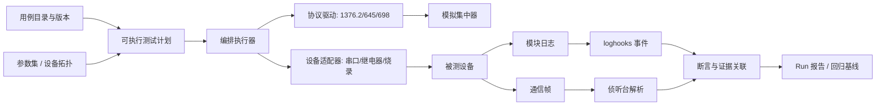

# GW-CASS 自动化验证能力迁移与统一工作台设计

> 状态：建议方案  
> 日期：2026-08-15  
> 来源项目：`D:\03-自动化改造\GW-CASS`  
> 目标项目：本仓库的 `apps/workbench/`、`libs/sim_concentrator/`、`libs/loghooks/`、`apps/listener/`、`apps/module_log/`

## 1. 结论

应当迁移 GW-CASS 的**测试资产和测试语义**，而不是迁移其整体实现。

GW-CASS 已积累了很有价值的国网 376.2 / 645 / 698 用例目录、人工步骤、设备参数、报文交互方式和失败经验；但自动化执行逻辑集中在 `web_gateway/ToolThread.py` 的 8,989 行大线程中，依赖全局变量、行号、字符串结果和同步轮询。直接复制会把当前项目重新带回“巨型测试线程 + 全局状态”的架构。

目标工作台应建设为一个**可执行用例平台**：



统一工作台不是“把所有页面放在一起”，而是负责以下六件事：管理测试资产、准备运行环境、调度设备、执行步骤、收集多源证据、生成可复现的结论。

## 2. 两个项目的能力对比

| 维度 | GW-CASS | 当前项目 | 设计取舍 |
|---|---|---|---|
| 用例资产 | 97 组人工步骤、按 AFN/流程/功能/地区分类 | 4 个 JSON 验证场景 | 将前者迁为用例目录和迁移清单；不能直接当可执行脚本 |
| 协议交互 | 376.2/645/698 报文构造、收发、按字段判定 | 1376.2 模拟集中器、帧解码与匹配 | 保留当前 `sim_concentrator` 作为统一驱动内核，补充协议动作插件 |
| 设备操作 | 主测串口、继电器串口、全局状态 | 独立的 listener / module_log 串口服务、烧录 | 增加受资源锁保护的设备适配器层，不共享全局串口对象 |
| 运行模型 | 单线程按 `Test_*` 方法执行、全局停止标志 | Run、RunStep、Report、SQLite/JSON 存档 | 重构为可取消、可观测、可恢复的 Run 状态机 |
| 断言 | 分散在测试方法里的字符串比较和超时判断 | 帧匹配、事件流对比、负向断言、反馈规则 | 统一成结构化断言，支持帧/事件/时序/状态四类 |
| 结果 | 表格状态、文本日志、Excel | JSON 报告、SQLite Run 元数据 | JSON 为事实源，Excel/PDF 仅作为导出格式 |
| 证据链 | 串口输出为主 | 模块日志、侦听帧、解析结果、事件规则 | 以关联 ID 统一到同一 Run 和同一步骤 |

## 3. GW-CASS 中值得迁移的部分

### 3.1 直接迁移：测试资产与业务知识

下列内容应保留来源、版本和可追溯关系后导入本项目：

- `TestSce.json` 的用例分类树：AFN 协议一致性、流程、功能、深化应用、异常、兼容性、区域扩展、外设等。
- `TEST_CASE_CONTENT` 的标题、人工操作说明、预期结果和合并行信息。
- `TEST_PARA` 中的设备地址、版本号、表地址等参数类型定义；实际值不应作为公共默认值提交。
- 已验证的构帧规则、响应字段判断、超时说明和失败提示。
- 兼容性矩阵的测试意图，例如 1 对 1、1 对 3、1 对 16 等网络/抄表组合。
- 继电器 Modbus 操作语义及其安全前置条件。

### 3.2 可参考但需要重写：自动化执行能力

| GW-CASS 能力 | 当前项目中的落点 | 改造要求 |
|---|---|---|
| `Tool_Rx_Thread` 收帧与超时 | `libs/sim_concentrator/serial_io.py` | 统一帧缓存、取消令牌、超时与资源释放；不再写全局接收列表 |
| `Tx_SendData` / `Tx_RelaySendData` | 新增 `test_automation/adapters/serial.py`、`relay.py` | 一个设备连接一个适配器实例；对端口加互斥锁 |
| `Test_*` 方法中的报文交互 | 新增协议动作与断言插件 | 每个用例由数据驱动的步骤组合，不再用方法名+行号映射 |
| `TestStats` / Excel 输出 | 扩展 `Report` 与导出器 | JSON 报告为唯一事实源；Excel 可按模板生成 |
| `gTestStartType` 停止标志 | Run 控制器 | 使用取消请求、资源清理和明确状态：pending/running/passed/failed/aborted |
| WebSocket 进度推送 | workbench 的 Run 事件流 | 事件包含 `run_id`、`step_id`、时间、级别、证据引用 |

### 3.3 不应迁移

- `GlobalVariable.py` 的全局串口、全局地址、全局接收缓存和全局运行开关。
- `ToolThread.py` 中“用例名称 → `intFlag_n` → 方法名 → TestSce 行号”的隐式映射。
- 用 `time.sleep()` 固定等待代替“等待某帧/某事件，超时失败”的逻辑。
- 测试方法中混杂的 UI 回调、串口收发、协议构帧、断言、统计和 Excel 写入。
- 以“合格/不合格”字符串作为唯一机器判断结果。
- 覆盖原始 `TestSce.json` 的上传模式；迁入后测试资产必须版本化、可审核、可回滚。

## 4. 关键事实：TestSce 不是可执行用例

GW-CASS 的 `TestSce.json` 有两部分：

1. `TEST_CASE_LIST`：用例目录树，例如 AFN=03H 的 F1~F100、流程测试、功能测试、区域扩展。
2. `TEST_CASE_CONTENT`：标题、人工步骤和预期结果，例如“模拟集中器发送某帧，观察 CCO 是否正确响应”。

这些数据适合作为**用例说明书和测试覆盖目录**，但没有统一表达下列必要信息：构帧参数、前置条件、设备拓扑、等待条件、字段断言、清理动作、重试策略、是否可自动化。因此必须经历以下转换：

```text
GW-CASS 用例说明
  → 迁移登记（保留原始来源）
  → 自动化可行性评审
  → 可执行测试计划（DSL）
  → 运行时编译为动作与断言
  → Run 结果与证据
```

## 5. 目标架构与拆分

建议在 `apps/workbench/` 下建立编排和展示，在 `libs/` 下建立可复用自动化内核。不要把它们放回单个应用文件。

```text
apps/workbench/
├── automation_api.py              # 用例、计划、Run、导出接口
├── orchestration/                 # 现有 Run/Report/比较/反馈，扩展为编排边界
└── static/pages/automation/       # 用例库、设备、运行、报告四个页面

libs/test_automation/
├── models.py                      # Case / Plan / Step / Assertion / Evidence
├── catalog.py                     # 用例目录、标签、版本和来源
├── compiler.py                    # DSL 校验和编译
├── executor.py                    # Run 状态机、取消、重试、失败策略
├── resources.py                   # 串口/继电器/设备资源租约与互斥
├── events.py                      # Run 过程事件模型和发布接口
├── adapters/
│   ├── serial.py                  # 原始串口设备
│   ├── relay.py                   # Modbus 继电器
│   ├── flasher.py                 # 复用 module_log XMODEM 烧录
│   ├── simcon.py                  # 复用 sim_concentrator
│   ├── listener.py                # 复用 listener 帧采集与解析
│   └── loghooks.py                # 复用事件扫描/实时事件订阅
├── actions/
│   ├── protocol.py                # send_13762 / send_645 / send_698
│   ├── device.py                  # flash / relay_set / wait_ready
│   └── control.py                 # wait / retry / checkpoint
└── assertions/
    ├── frame.py                   # 帧字段、嵌套字段、无响应断言
    ├── event.py                   # loghooks 事件、负向事件断言
    ├── timing.py                  # 时间窗、顺序、重试次数
    └── state.py                   # 设备/端口/烧录状态

test_assets/
├── catalog/                       # 用例元信息；可从 TestSce 导入
├── plans/                         # 已自动化的可执行 JSON/YAML 计划
├── parameters/                    # 脱敏参数集与拓扑模板
├── fixtures/                      # 模拟串口、golden 帧、日志样本
└── migration/                     # GW-CASS 用例映射与评审状态
```

### 5.1 六个核心边界

| 模块 | 责任 | 不负责什么 |
|---|---|---|
| 用例目录 Catalog | 分类、来源、标签、优先级、人工/自动化状态 | 不执行设备操作 |
| 测试计划 Plan | 可执行步骤、参数引用、前置/清理、断言 | 不持有串口 |
| 执行器 Executor | 运行状态机、超时、重试、取消、失败策略 | 不理解某个 AFN 的具体字节 |
| 设备适配器 Adapter | 串口、继电器、烧录、监听、模拟集中器 | 不解释业务流程 |
| 动作与断言插件 | 构帧、下发、等待、字段/事件判定 | 不控制 UI 或报告格式 |
| 报告与证据 Evidence | 关联报文、日志、解析、断言和产物 | 不重新执行测试 |

## 6. 可执行用例模型

### 6.1 用例元信息：说明“测什么”

```json
{
  "id": "gw.afn03.f01.version",
  "name": "AFN=03H-F1 厂商代码和版本信息",
  "source": {"system": "GW-CASS", "case_title": "AFN=03H-F1厂商代码和版本信息"},
  "category": ["AFN功能/协议一致性", "AFN=03H"],
  "tags": ["376.2", "query", "cco"],
  "automation": {"status": "ready", "plan_id": "gw.afn03.f01.version.v1"},
  "risk": "low",
  "requires": ["cco_serial", "cco_address"]
}
```

### 6.2 可执行计划：说明“怎么测”

计划采用 JSON 或 YAML，运行前做 schema 校验。首版只覆盖稳定、可观察、无需人工干预的动作。

```yaml
id: gw.afn03.f01.version.v1
case_id: gw.afn03.f01.version
parameters: profile.cco-default
resources:
  - id: cco_serial
    mode: exclusive
setup:
  - action: serial.flush
steps:
  - id: query-version
    action: protocol.send_13762
    with:
      afn: "03"
      fn: 1
      target: ${params.cco.address}
    expect:
      - type: frame
        within_ms: 5000
        fields:
          afn: "83"
          fn: 1
      - type: frame_field
        path: data.version
        equals: ${params.cco.version}
  - id: version-log
    action: evidence.wait_event
    optional: true
    expect:
      - type: event
        event_type: cco.version.reply
        within_ms: 5000
cleanup:
  - action: serial.flush
```

### 6.3 统一断言

每条断言都应返回相同结构：

```json
{
  "id": "query-version.expect.frame",
  "type": "frame",
  "expected": {"afn": "83", "fn": 1},
  "actual": {"afn": "83", "fn": 1, "raw_frame_ref": "artifact://..."},
  "verdict": "pass",
  "reason": "AFN 与 Fn 匹配",
  "evidence": ["artifact://run/.../frames/0003.json"]
}
```

支持四种首要断言：

- 帧断言：是否收到帧、AFN/方向/地址/嵌套字段是否匹配、期望无响应。
- 事件断言：是否出现/不出现指定 `loghooks` 事件。
- 时序断言：事件顺序、时间窗、重试次数。
- 状态断言：端口、烧录、继电器、设备就绪状态。

## 7. 与已有模块的集成方式

| 现有模块 | 在统一工作台中的角色 | 集成原则 |
|---|---|---|
| `libs/sim_concentrator` | 1376.2 帧构造、串口 IO、应答器、帧匹配 | 作为协议驱动实现，补强为可被 Executor 调用的动作，不复制帧逻辑 |
| `apps/listener` | 通信帧证据采集、协议解析、分钟采集统计 | 一个 Run 可订阅/查询其帧结果；解析结果作为证据，不把 listener 当测试执行器 |
| `apps/module_log` | 模块日志、串口状态、XMODEM 烧录 | 通过适配器使用其服务，不与自动化驱动争用同一 COM 口 |
| `libs/loghooks` | 日志到事件的标准化转换 | 用事件名作为流程断言，不在测试用例里写日志字符串匹配 |
| `apps/workbench/orchestration` | Run、报告、比较、反馈、存储 | 扩展数据模型和执行编排；保留当前轻量场景兼容路径 |
| `libs/parser_lib` / `shared` | 645/698/HPLC 解析与字段语义 | 用作 frame assertion 的字段提供者和报告富化器 |

### 7.1 串口与资源冲突是首要约束

同一个 COM 口不能同时被 listener、module_log、模拟集中器或继电器驱动各自独占。工作台必须在 Run 开始前申请资源租约：

```text
资源声明 → 可用性检查 → 获取独占锁 → 执行 → 释放/故障清理
```

如果需要“发包的同时侦听”，必须由同一个底层串口会话分发数据，或使用物理上独立的监听口；不能让两个 Python 进程竞争打开同一端口。

## 8. 首批自动化用例如何选择

不要从 97 组用例同时迁移。首批目标是证明新架构可闭环，而不是追求用例数量。

| 优先级 | 用例类型 | 建议范围 | 原因 |
|---|---|---|---|
| P0 | 协议确认/否认、查询型 AFN | AFN 00、01、03、10 的稳定查询子集 | 前置条件少、帧断言明确、最适合验证协议驱动 |
| P0 | 配置—查询回读 | AFN 05 设置 + AFN 03/10 查询 | 能验证多步骤、字段断言、清理恢复 |
| P0 | 当前已有闭环场景 | 入网、分钟采集、搜表、拉合闸 | 直接复用 workbench、simcon、loghooks 的现有基础 |
| P1 | 645/698 绑表、抄表、事件上报 | 先用 golden 帧和模拟端，再接真实设备 | 涉及嵌套协议和设备状态，但产品价值高 |
| P1 | 继电器 Modbus 和停复电 | 在资源锁、安全检查和物理互锁后实施 | 会改变外设状态，必须具备安全护栏 |
| P2 | 多厂家/多节点兼容性矩阵 | 1x1、1x3、1x16 等 | 需要设备拓扑编排和并行资源管理 |
| P2 | 依赖人工触发的异常/事件 | 停复电、开表盖等 | 先定义人工检查点，再逐步接入可控电源/夹具 |

首批建议只选 10～15 个用例：5 个查询、3 个配置—回读、4 个现有流程、2 个失败/无响应用例。这批用例必须同时具备：真实设备验证、模拟串口单元测试、可归档报告。

## 9. 统一工作台的页面设计

工作台顶部保留现有业务页签，并新增“自动化验证”一级页签；页面不直接操作底层全局对象，全部通过 Run API。

```text
侦听台 | 模块日志 | 对照解析 | 模拟集中器 | 自动化验证 | 报告中心
```

自动化验证页分为四个连续区域：

1. **用例库**：按 GW-CASS 分类树浏览；显示自动化状态（未评审、半自动、可执行、阻塞）、标签、前置条件和覆盖关系。
2. **运行配置**：选择参数集、设备拓扑、固件版本、测试集合和失败策略；执行前进行端口/依赖检查。
3. **实时运行**：展示 Run 时间线、当前步骤、下发/接收帧、事件、断言、超时和取消按钮。
4. **报告中心**：按 Run 查看总览、用例结果、失败聚类、帧/日志/解析证据和导出。

“模拟集中器”页继续保留给工程师做单任务调试；“自动化验证”页用于批量、可重复、可追溯的正式测试。两者不能共用同一串口会话而没有资源协调。

## 10. 分阶段实施建议

### 阶段 1：资产盘点与迁移基线

- 导入 GW-CASS 用例树和 97 组人工步骤，建立唯一 `case_id`、来源和版本。
- 给每个用例打上 `manual`、`semi_automated`、`automatable`、`blocked` 状态。
- 将 `ToolThread.py` 中的 `Test_*` 方法逐项登记为“协议动作、断言、设备操作、人工步骤、已知失败条件”。
- 建立“GW-CASS 用例 → 新 Case → 新 Plan → Run”映射表，避免遗漏或重复。

### 阶段 2：自动化内核与 1376.2 试点

- 建立 `test_automation` 的 Plan、Executor、Resource、Assertion、Evidence 五个基础模块。
- 以现有 `sim_concentrator` 实现 `protocol.send_13762`、`frame`、`no_reply` 三个动作/断言。
- 接入 `RunStore`，使执行过程和报告符合当前 workbench 的 Run 模型。
- 落地首批 AFN 查询和配置—回读用例。

### 阶段 3：多源证据和工作台体验

- 将 loghooks 事件和 listener 帧解析按 `run_id`/时间窗关联到每一步。
- 建立实时 Run 事件流和自动化验证页面。
- 补充 JSON→Excel 导出器，以兼容现有测试交付习惯。
- 引入 golden 帧、模拟串口和场景回放，保障无硬件回归。

### 阶段 4：复杂流程、外设和兼容性矩阵

- 接入 645/698 动作与嵌套字段断言。
- 接入继电器、烧录和可控外设，加入明确的安全确认和恢复步骤。
- 引入设备拓扑、并行资源调度、厂家/版本维度报告和兼容性矩阵。
- 将人工触发步骤显式建模为 `manual_checkpoint`，而不是伪装成自动通过。

## 11. 迁移验收标准

迁移不是把页面跑起来，而应满足以下标准：

- 每个已迁移用例都能追溯到 GW-CASS 的来源标题和原始说明。
- 每个 `ready` 用例都有可验证的前置条件、清理动作、结构化断言和失败原因。
- 同一用例可在模拟串口下稳定重复运行，也可在真实设备上运行并产生证据。
- Run 报告能定位到下发帧、接收帧、解析结果、模块日志事件和参数集版本。
- 取消、超时、串口占用、设备异常时，资源可以释放，Run 状态为 `aborted` 或 `failed`，不遗留“假运行中”。
- Excel 导出与页面展示均由同一份 JSON 报告生成，不能出现两套统计口径。
- 对无法自动化的用例明确说明所缺少的设备、夹具、控制接口或人工操作，不把它们计入自动化通过率。

## 12. 风险与防护

| 风险 | 后果 | 设计防护 |
|---|---|---|
| 直接搬迁大线程 | 新系统再次形成不可维护单体 | 以 Plan/Action/Assertion/Adapter 拆分；逐用例迁移 |
| 同串口多服务抢占 | 数据丢失、误判、端口占用 | Run 资源租约、独占锁、统一会话或物理隔离 |
| 参数和设备状态未复位 | 后续用例结果不可信 | 每个 Plan 必须声明 setup/cleanup；报告记录实际参数 |
| 固定 sleep | 测试慢且偶发失败 | 事件/帧等待 + 超时 + 重试策略 |
| 人工用例被计入自动化 | 自动化率虚高 | 单独标识 manual checkpoint 与 blocked 原因 |
| 报告只有结论没有证据 | 无法复盘失败 | 所有断言都携带 evidence 引用 |
| 控电/烧录误操作 | 设备和现场风险 | 危险动作单独授权、设备白名单、确认和恢复步骤 |

## 13. 推荐的下一步

先完成阶段 1 的迁移清单，再实施阶段 2 的 10～15 个试点用例。第一批应优先验证“一个统一 Run 能同时看到下发帧、回包字段断言、模块日志事件和最终报告”，因为这才是当前项目相对 GW-CASS 的增量价值。

GW-CASS 提供的是丰富的协议测试知识库；当前项目应把它升级为可扩展、可追溯、可持续回归的验证平台。

